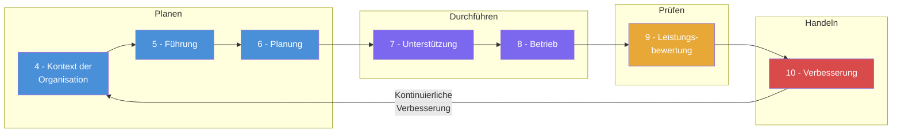
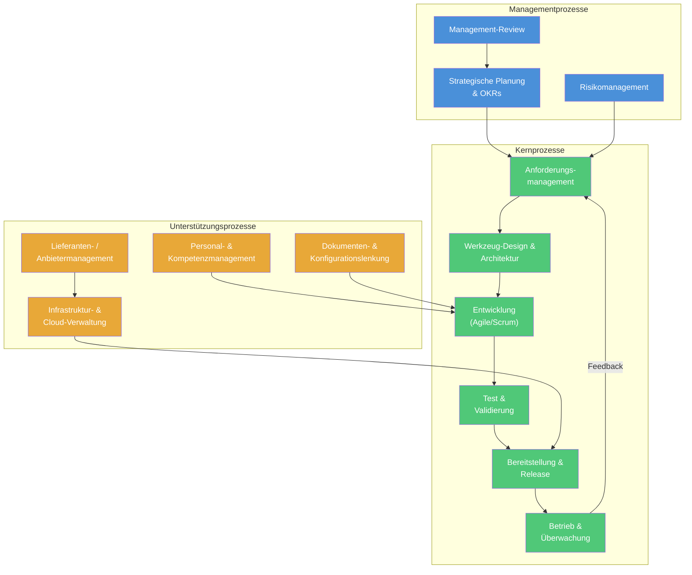
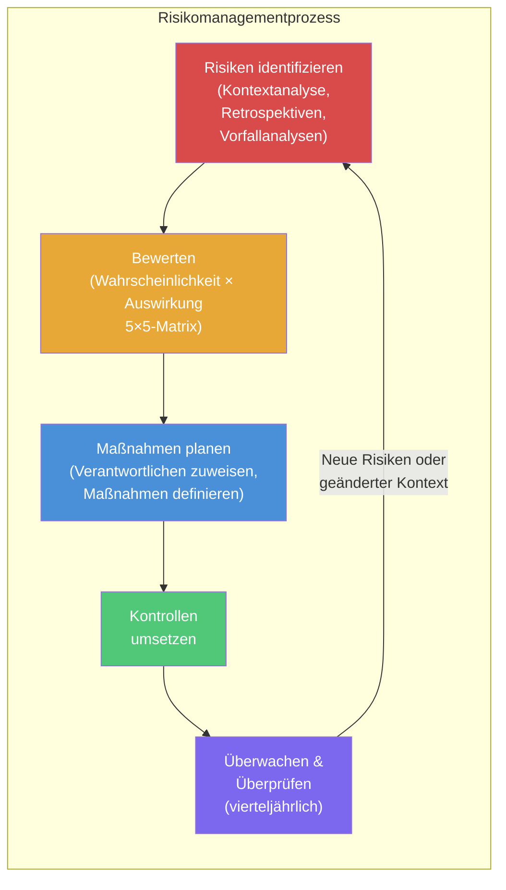
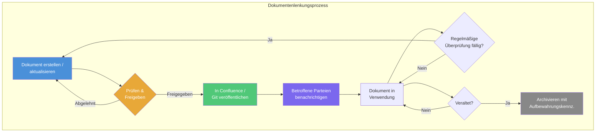
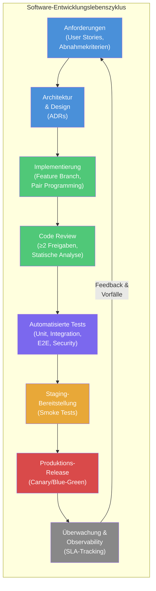
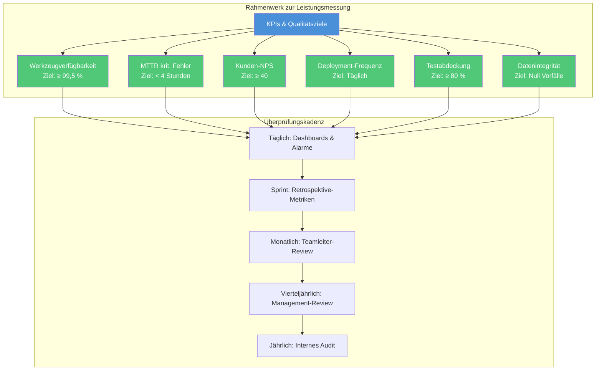
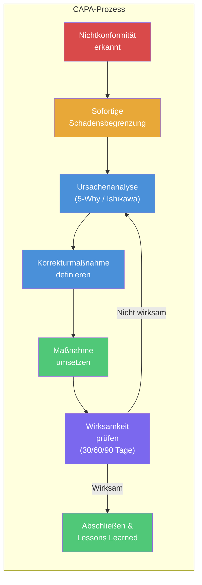
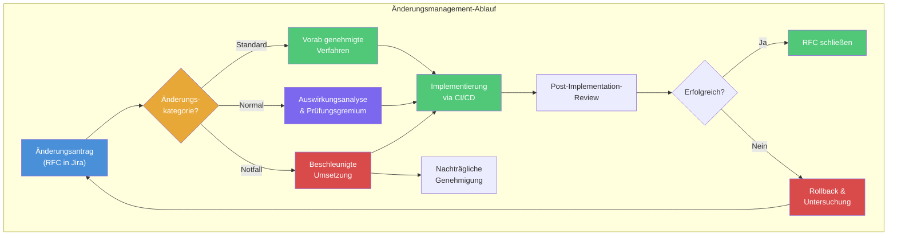

# ISO 9001:2015 Auditvorbereitung – Fragenkatalog

## Data Driven Development (DDD) Abteilung — Werkzeuge für AD/ADAS Validierung & Entwicklung

> **Geltungsbereich:** Dieser Katalog deckt alle Abschnitte der ISO 9001:2015 ab, die für unsere Abteilung relevant sind.
> Wir entwickeln und pflegen Werkzeuge für Datenengineering, Speicherung, Simulation und Reprocessing,
> die von Softwareentwicklern für Autonomes Fahren (AD) und Fahrerassistenzsysteme (ADAS) genutzt werden.

---

## Verwendung dieses Dokuments

1. **Vor dem Audit:** Gehen Sie jeden Abschnitt durch und stellen Sie sicher, dass Sie zu jeder Frage Auskunft geben können
2. **Während des Audits:** Nutzen Sie die vorgeschlagenen Antworten als Orientierung — sprechen Sie natürlich, nicht abgelesen
3. **Referenzdokumente:** Jeder Abschnitt verweist auf unterstützende Dokumente, die Sie griffbereit haben sollten
4. **Grundprinzip:** Auditoren möchten sehen, dass Prozesse existieren, befolgt werden, gemessen werden und verbessert werden

---

## ISO 9001:2015 Abschnitte im Überblick

---

## Inhaltsverzeichnis

- [Abschnitt 4: Kontext der Organisation](#abschnitt-4-kontext-der-organisation)
- [Abschnitt 5: Führung](#abschnitt-5-führung)
- [Abschnitt 6: Planung](#abschnitt-6-planung)
- [Abschnitt 7: Unterstützung](#abschnitt-7-unterstützung)
- [Abschnitt 8: Betrieb](#abschnitt-8-betrieb)
- [Abschnitt 9: Leistungsbewertung](#abschnitt-9-leistungsbewertung)
- [Abschnitt 10: Verbesserung](#abschnitt-10-verbesserung)
- [Querschnittsthemen](#querschnittsthemen)

---

## Abschnitt 4: Kontext der Organisation

### 4.1 Verstehen der Organisation und ihres Kontexts

| Nr. | Typische Auditorfrage | Antworthinweise |
|-----|----------------------|-----------------|
| 4.1.1 | **Was macht Ihre Abteilung? Beschreiben Sie Ihren Geltungsbereich.** | „Wir sind die Data Driven Development (DDD) Abteilung. Wir entwickeln und pflegen Werkzeuge für Datenengineering, Speicherung, Simulation und Reprocessing. Unsere Kunden sind Softwareentwickler, die an Funktionen für Autonomes Fahren und ADAS arbeiten. Wir stellen die Infrastruktur und Werkzeuge bereit, die es ihnen ermöglichen, Wahrnehmungs-, Planungs- und Regelungsalgorithmen anhand realer und simulierter Fahrdaten zu validieren und zu entwickeln." |
| 4.1.2 | **Welche wesentlichen externen und internen Themen beeinflussen die Fähigkeit Ihrer Organisation, die beabsichtigten Ergebnisse des QMS zu erreichen?** | **Extern:** Regulatorische Landschaft für AD (UN R157, EU AI Act), Halbleiter-Lieferengpässe, sich entwickelnde Sensortechnologie, OEM-Plattformänderungen, Cybersecurity-Anforderungen (ISO 21434). **Intern:** Schnelles Wachstum, Cloud-Kostenmanagement, teamübergreifende Abhängigkeiten, Fachkräftebindung im wettbewerbsintensiven AD-Markt, technische Schulden in Legacy-Werkzeugen. *Referenz:* [Kontextanalyse (SWOT)](../qms-framework/context-analysis.md) |
| 4.1.3 | **Wie überwachen und überprüfen Sie diese Themen?** | „Wir führen vierteljährliche Kontextüberprüfungen im Rahmen unseres Management-Review-Zyklus durch. Externe Themen werden über unsere regulatorische Beobachtungsliste und die Teilnahme an Branchenveranstaltungen verfolgt. Interne Themen werden durch Retrospektiven, Team-Health-Checks und OKR-Reviews sichtbar." |

### 4.2 Verstehen der Erfordernisse und Erwartungen interessierter Parteien

| Nr. | Typische Auditorfrage | Antworthinweise |
|-----|----------------------|-----------------|
| 4.2.1 | **Wer sind Ihre interessierten Parteien?** | AD/ADAS-Softwareentwickler (Hauptkunden), Management (Budget & Strategie), Regulierungsbehörden, Datenanbieter (Flottendaten-Eigentümer), Cloud-Infrastruktur-Anbieter (AWS/Azure), Partner-OEM-Teams, Betriebsrat, Informationssicherheits-Team. |
| 4.2.2 | **Wie ermitteln Sie deren Anforderungen?** | „Wir pflegen ein Stakeholder-Register. Anforderungen werden erfasst durch: regelmäßige Abstimmungen mit AD-Teams (Sprint Reviews), SLAs mit Plattform-Nutzern, Compliance-Anforderungen von InfoSec und Rechtsabteilung sowie Feedback über unser internes Tooling-Portal." *Referenz:* [Stakeholder-Register](../qms-framework/stakeholder-register.md) |

### 4.3 Geltungsbereich des QMS

| Nr. | Typische Auditorfrage | Antworthinweise |
|-----|----------------------|-----------------|
| 4.3.1 | **Was ist der Geltungsbereich Ihres QMS?** | „Design, Entwicklung, Bereitstellung und Wartung von Datenengineering-Werkzeugen, Simulationsumgebungen, Datenspeicherlösungen und Reprocessing-Pipelines für die Softwarevalidierung im Bereich Autonomes Fahren und ADAS. Dies umfasst CI/CD-Toolchains, Datenkatalogisierung, Simulation-as-a-Service und großskalige Daten-Replay-Infrastruktur." |
| 4.3.2 | **Sind Abschnitte ausgeschlossen?** | „Wir stellen keine physischen Produkte her, daher gelten Aspekte von Abschnitt 8 bezüglich Produktion, Lieferung physischer Güter und Nachlieferungsaktivitäten für Hardware nicht. Wir haben diesen Ausschluss mit Begründung dokumentiert." *Referenz:* [QMS-Geltungsbereich](../qms-framework/qms-scope.md) |

### 4.4 QMS und seine Prozesse

| Nr. | Typische Auditorfrage | Antworthinweise |
|-----|----------------------|-----------------|
| 4.4.1 | **Können Sie mir Ihre Prozesslandschaft / Prozesslandkarte zeigen?** | „Ja — hier ist unsere Prozesslandkarte mit unseren Kern-, Management- und Unterstützungsprozessen." *Referenz:* [QMS-Prozesslandkarte](process-map.md) |
| 4.4.2 | **Wie bestimmen Sie Eingaben, Ergebnisse, Abfolge und Wechselwirkungen der Prozesse?** | „Jeder Prozess hat eine dokumentierte Prozessbeschreibung mit definierten Eingaben, Ergebnissen, verantwortlichen Rollen, KPIs und Schnittstellen. Diese werden in unserem Confluence-Bereich gepflegt und jährlich überprüft." |

---

## Abschnitt 5: Führung

### 5.1 Führung und Verpflichtung

| Nr. | Typische Auditorfrage | Antworthinweise |
|-----|----------------------|-----------------|
| 5.1.1 | **Wie zeigt die oberste Leitung ihr Engagement für das QMS?** | „Unsere Abteilungsleitung nimmt an vierteljährlichen Management-Reviews teil, unterzeichnet die Qualitätspolitik, stellt Budget für Qualitätsinitiativen bereit (Werkzeuge, Schulungen, Audits) und fördert aktiv die Qualitätsziele in All-Hands-Meetings und der OKR-Planung." |
| 5.1.2 | **Wie stellt die Führung die Kundenorientierung sicher?** | „Wir führen vierteljährliche NPS-Umfragen bei unseren AD/ADAS-Entwicklungsteams durch, verfolgen Tool-Nutzungsmetriken, pflegen eine öffentliche Roadmap auf Basis von Nutzerfeedback, und unsere Abteilungsleitung nimmt persönlich an wichtigen Kundeneskalationsmeetings teil." |
| 5.1.3 | **Wie werden Qualitätsverantwortlichkeiten kommuniziert?** | „Qualitätsrollen sind in unserer RACI-Matrix definiert. Jedes Team hat einen designierten Quality Champion. Die QMS-Verantwortlichkeiten sind Teil des Onboardings und in unserem Team-Wiki dokumentiert." |

### 5.2 Qualitätspolitik

| Nr. | Typische Auditorfrage | Antworthinweise |
|-----|----------------------|-----------------|
| 5.2.1 | **Können Sie mir Ihre Qualitätspolitik zeigen?** | *Halten Sie diese ausgedruckt und ausgehängt bereit.* „Unsere Qualitätspolitik verpflichtet uns, zuverlässige, skalierbare und sichere Werkzeuge bereitzustellen, die unseren AD/ADAS-Ingenieuren ermöglichen, Funktionen des autonomen Fahrens mit Vertrauen zu validieren. Wir verpflichten uns zur kontinuierlichen Verbesserung, zur Einhaltung anwendbarer Anforderungen und zur datengestützten Entscheidungsfindung." *Referenz:* [Qualitätspolitik](../qms-framework/quality-policy.md) |
| 5.2.2 | **Wie wird die Qualitätspolitik kommuniziert?** | „Sie ist auf unserer Confluence-Startseite veröffentlicht, in den Onboarding-Materialien enthalten, wird in Sprint-Retrospektiven referenziert und in unserem Teambereich ausgehängt. Alle Teammitglieder haben sie zur Kenntnis genommen." |

### 5.3 Rollen, Verantwortlichkeiten und Befugnisse

| Nr. | Typische Auditorfrage | Antworthinweise |
|-----|----------------------|-----------------|
| 5.3.1 | **Wer ist für das QMS verantwortlich?** | „Unser Qualitätsmanagementbeauftragter (QMB) ist [Name], der direkt an die Abteilungsleitung berichtet. Die tägliche Qualitätsarbeit liegt bei den Quality Champions der einzelnen Teams. Der QMB koordiniert Audits, verwaltet das Dokumentensystem und berichtet über die QMS-Leistung." |
| 5.3.2 | **Wie sind Rollen und Verantwortlichkeiten definiert?** | „Über unsere RACI-Matrix, Stellenbeschreibungen und Team-Charters. Diese sind in Confluence dokumentiert und werden im Management-Review überprüft." *Referenz:* [RACI-Matrix](../qms-framework/raci-matrix.md) |

---

## Abschnitt 6: Planung

### 6.1 Maßnahmen zum Umgang mit Risiken und Chancen

| Nr. | Typische Auditorfrage | Antworthinweise |
|-----|----------------------|-----------------|
| 6.1.1 | **Wie identifizieren und managen Sie Risiken?** | „Wir pflegen ein Risikoregister, das vierteljährlich überprüft wird. Risiken werden nach Eintrittswahrscheinlichkeit und Auswirkung in einer 5×5-Matrix kategorisiert. Jedes Risiko hat einen Verantwortlichen, Maßnahmen zur Minderung und ein Zieldatum. Für kritische Werkzeugkomponenten setzen wir FMEA ein." *Referenz:* [Risikoregister](../planning/risk-register.md) |
| 6.1.2 | **Können Sie ein Beispiel für ein identifiziertes Risiko und dessen Behandlung nennen?** | *Bereiten Sie 2–3 konkrete Beispiele vor, z. B.:* „Wir haben festgestellt, dass ein Single-Point-of-Failure in unserer Datenaufnahme-Pipeline das Reprocessing für alle AD-Teams stoppen könnte. Wir haben redundante Aufnahmepfade und automatisiertes Failover implementiert und die potenzielle Ausfallzeit von Stunden auf Minuten reduziert." |
| 6.1.3 | **Wie identifizieren Sie Chancen?** | „Durch Retrospektiven, Kundenfeedback-Sessions, Technology-Radar-Reviews und Benchmarking gegen Branchenbestpraktiken. Chancen werden in unserem Backlog erfasst und in der OKR-Planung priorisiert." |

### 6.2 Qualitätsziele

| Nr. | Typische Auditorfrage | Antworthinweise |
|-----|----------------------|-----------------|
| 6.2.1 | **Was sind Ihre Qualitätsziele?** | „Unsere Qualitätsziele sind mit unseren OKRs abgestimmt und umfassen: (1) Werkzeugverfügbarkeit ≥ 99,5 %, (2) Mittlere Behebungszeit für kritische Fehler < 4 h, (3) Kundenzufriedenheit (NPS) ≥ 40, (4) Null Datenintegritätsvorfälle in Reprocessing-Pipelines, (5) 100 % der Releases bestehen die automatisierte Regressionstestsuite." |
| 6.2.2 | **Wie messen Sie den Fortschritt bei diesen Zielen?** | „Jedes Ziel hat einen definierten KPI, eine Messmethode, Frequenz und einen Verantwortlichen. Wir verfolgen sie auf unseren Grafana-Dashboards und überprüfen sie monatlich im Teamleiter-Meeting und vierteljährlich im Management-Review." |
| 6.2.3 | **Sind die Qualitätsziele konsistent mit der Qualitätspolitik?** | „Ja — unsere Politik verpflichtet uns zu Zuverlässigkeit, Sicherheit und datengestützter Verbesserung. Jedes Ziel ist direkt einem dieser Verpflichtungen zugeordnet. Wir pflegen eine Rückverfolgbarkeitsmatrix." *Referenz:* [Qualitätsziele](../planning/quality-objectives.md) |

### 6.3 Planung von Änderungen

| Nr. | Typische Auditorfrage | Antworthinweise |
|-----|----------------------|-----------------|
| 6.3.1 | **Wie planen Sie Änderungen am QMS?** | „Änderungen am QMS werden über unseren Änderungsmanagementprozess gesteuert. Geplante Änderungen werden dokumentiert, hinsichtlich ihrer Auswirkungen bewertet, vom QMB und der Abteilungsleitung genehmigt, an betroffene Parteien kommuniziert und bis zum Abschluss nachverfolgt. Wir nutzen RFC-Tickets (Request for Change) in Jira." |

---

## Abschnitt 7: Unterstützung

### 7.1 Ressourcen

| Nr. | Typische Auditorfrage | Antworthinweise |
|-----|----------------------|-----------------|
| 7.1.1 | **Wie ermitteln und stellen Sie die benötigten Ressourcen bereit?** | „Die Ressourcenplanung erfolgt während der vierteljährlichen OKR-Planung. Wir bewerten Personalbedarf, Cloud-Infrastrukturkapazität, Werkzeuglizenzen und Schulungsbudgets. Ressourcenlücken werden über das Management-Review eskaliert." |
| 7.1.2 | **Wie verwalten Sie Ihre Infrastruktur (Entwicklungsumgebungen, Cloud-Ressourcen)?** | „Wir nutzen Infrastructure-as-Code (Terraform/SST) für alle Cloud-Ressourcen. Umgebungen sind versionskontrolliert. Wir haben getrennte Entwicklungs-, Staging- und Produktionsumgebungen mit definierten Beförderungskriterien." |
| 7.1.3 | **Wie stellen Sie sicher, dass die Überwachungs- und Messressourcen angemessen sind?** | „Unsere Testinfrastruktur wird durch regelmäßige Validierung kalibriert. CI/CD-Pipelines beinhalten automatisierte Prüfungen. Leistungs-Benchmarks werden als Baseline erfasst und nachverfolgt. Das SLA-Monitoring nutzt branchenübliche Observability-Stacks (Prometheus, Grafana, PagerDuty)." |

### 7.2 Kompetenz

| Nr. | Typische Auditorfrage | Antworthinweise |
|-----|----------------------|-----------------|
| 7.2.1 | **Wie ermitteln Sie die erforderlichen Kompetenzen?** | „Jede Rolle hat ein Kompetenzprofil, das erforderliche technische Fähigkeiten (z. B. Python, Cloud-Architektur, Datenengineering), Domänenwissen (AD/ADAS) und Soft Skills definiert. Diese sind in unserer Kompetenzmatrix dokumentiert." *Referenz:* [Kompetenzmatrix](../support/competency-matrix.md) |
| 7.2.2 | **Wie stellen Sie sicher, dass Mitarbeiter kompetent sind?** | „Durch strukturiertes Onboarding (30-60-90-Tage-Plan), regelmäßige 1:1-Gespräche mit Kompetenzbeurteilungen, jährliche Entwicklungspläne, interne Tech Talks, Konferenzteilnahmen und verpflichtende Schulungen für kritische Prozesse." |
| 7.2.3 | **Wie pflegen Sie Kompetenznachweise?** | „Schulungsnachweise werden in unserem HR-System (SuccessFactors) geführt. Technische Zertifizierungen werden in unserem Team-Wiki erfasst. Der Abschluss des Onboardings wird von Teamleitern bestätigt." |

### 7.3 Bewusstsein

| Nr. | Typische Auditorfrage | Antworthinweise |
|-----|----------------------|-----------------|
| 7.3.1 | **Wie stellen Sie sicher, dass Mitarbeiter die Qualitätspolitik kennen und ihren Beitrag zur Wirksamkeit des QMS verstehen?** | „Durch das Onboarding, vierteljährliche All-Hands-Meetings, in denen Qualitätskennzahlen vorgestellt werden, Sprint-Retrospektiven und die sichtbare Darstellung der Qualitätspolitik auf unserer Confluence-Startseite. Die Teammitglieder verstehen, dass die Qualität unserer Werkzeuge direkt die Sicherheitsvalidierung autonomer Fahrzeuge beeinflusst." |

### 7.4 Kommunikation

| Nr. | Typische Auditorfrage | Antworthinweise |
|-----|----------------------|-----------------|
| 7.4.1 | **Wie legen Sie die interne und externe Kommunikation in Bezug auf das QMS fest?** | „Wir haben eine definierte Kommunikationsmatrix, die festlegt, was kommuniziert wird, wann, an wen und wie. Intern: Daily Standups, Sprint Reviews, Retrospektiven, Management-Reviews. Extern: Release Notes, SLA-Berichte, Vorfallbenachrichtigungen an nutzende Teams." *Referenz:* [Kommunikationsmatrix](../support/communication-matrix.md) |

### 7.5 Dokumentierte Information

| Nr. | Typische Auditorfrage | Antworthinweise |
|-----|----------------------|-----------------|
| 7.5.1 | **Wie lenken Sie die vom QMS geforderte dokumentierte Information?** | „Alle QMS-Dokumente werden in Confluence mit Versionskontrolle, Freigabe-Workflows und Zugriffskontrollen gepflegt. Code und Konfiguration liegen in Git (GitHub/GitLab) mit Branch-Protection und Code-Review-Pflicht. Wir unterscheiden zwischen gelenkten Dokumenten (Richtlinien, Verfahren) und Aufzeichnungen (Nachweise von Tätigkeiten)." |
| 7.5.2 | **Wie stellen Sie sicher, dass Dokumente aktuell und verfügbar sind?** | „Confluence-Bereiche haben benannte Verantwortliche, die Inhalte vierteljährlich überprüfen. Veraltete Seiten werden durch eine automatische Aktualitätsprüfung markiert. Git-Repositories nutzen Branch-Protection, um unbefugte Änderungen zu verhindern. Wir haben eine Aufbewahrungsrichtlinie für Dokumente." |
| 7.5.3 | **Wie schützen Sie dokumentierte Informationen?** | „Der Zugriff wird über AD-Gruppenrichtlinien gesteuert. Sensible Daten werden klassifiziert und gemäß unserem Informationsklassifizierungsschema behandelt. Sicherungen erfolgen automatisiert. Wir erfüllen die Informationssicherheitsrichtlinien der BMW Group." |

---

## Abschnitt 8: Betrieb

### 8.1 Betriebliche Planung und Steuerung

| Nr. | Typische Auditorfrage | Antworthinweise |
|-----|----------------------|-----------------|
| 8.1.1 | **Wie planen und steuern Sie Ihre betrieblichen Prozesse?** | „Wir arbeiten mit Agile/Scrum in 2-Wochen-Sprints. Epics sind auf OKRs rückverfolgbar. Jeder Sprint hat definierte Ziele, Abnahmekriterien und eine Definition of Done. Wir pflegen Architecture Decision Records (ADRs) für wesentliche technische Entscheidungen. Release Trains werden vierteljährlich geplant." |
| 8.1.2 | **Wie steuern Sie ausgelagerte Prozesse?** | „Wir steuern Cloud-Dienstleister (AWS/Azure) über SLAs und regelmäßige Service-Reviews. Drittanbieter von Werkzeugen werden gemäß unserem Lieferantenmanagementprozess bewertet. Open-Source-Komponenten werden erfasst und auf Schwachstellen geprüft." |

### 8.2 Anforderungen an Produkte und Dienstleistungen

| Nr. | Typische Auditorfrage | Antworthinweise |
|-----|----------------------|-----------------|
| 8.2.1 | **Wie ermitteln Sie die Kundenanforderungen an Ihre Werkzeuge?** | „Anforderungen werden erfasst durch: (1) direkte Zusammenarbeit mit AD/ADAS-Teams in Refinement-Sessions, (2) Feature Requests über unser internes Portal / Jira, (3) SLA-Verhandlungen für Plattformdienste, (4) regulatorische/Compliance-Anforderungen aus dem ASPICE/ISO 26262-Kontext, (5) technische Randbedingungen der AD-Plattformarchitektur." |
| 8.2.2 | **Wie überprüfen Sie Anforderungen, bevor Sie sich zur Lieferung verpflichten?** | „Jedes Feature durchläuft einen Refinement-Prozess, in dem wir Vollständigkeit, Machbarkeit und Testbarkeit prüfen. Abnahmekriterien werden vor Arbeitsbeginn definiert. Große Features erfordern ein Architecture Review. Wir bestätigen, dass wir SLAs einhalten können, bevor wir neue Plattformnutzer aufnehmen." |
| 8.2.3 | **Wie gehen Sie mit Änderungen an Anforderungen um?** | „Änderungen werden über unseren Jira-Workflow gesteuert. Scope-Änderungen während eines Sprints werden vom Scrum Master gekennzeichnet. Wesentliche Änderungen erfordern ein erneutes Refinement und eine Auswirkungsanalyse. Alle Änderungen sind nachverfolgbar." |

### 8.3 Entwicklung von Produkten und Dienstleistungen

| Nr. | Typische Auditorfrage | Antworthinweise |
|-----|----------------------|-----------------|
| 8.3.1 | **Wie planen Sie Design- und Entwicklungsaktivitäten?** | „Design und Entwicklung folgen unserem SDLC-Prozess: Anforderungen → Architektur-Design (ADRs) → Implementierung (Feature Branches) → Code Review → Test → Staging → Produktion. Jede Phase hat definierte Ein- und Austrittskriterien." |
| 8.3.2 | **Was sind die Eingaben für Ihren Designprozess?** | „Funktionale Anforderungen (User Stories), nichtfunktionale Anforderungen (Performance, Skalierbarkeit, Sicherheit), Schnittstellenspezifikationen, anwendbare Normen (ISO 26262 Tooling-Anforderungen, ASPICE), Lessons Learned aus vorherigen Releases und technische Randbedingungen." |
| 8.3.3 | **Wie steuern Sie Design und Entwicklung?** | „Durch Code Reviews (mindestens 2 Freigaben), automatisierte CI/CD-Pipelines (Lint, Test, Security Scan), Architecture Reviews für wesentliche Änderungen und Sprint Demos zur Stakeholder-Validierung." |
| 8.3.4 | **Was sind die Ergebnisse Ihres Designprozesses?** | „Bereitgestellte Werkzeuge/Services, die definierte Abnahmekriterien erfüllen, API-Dokumentation, Benutzerhandbücher, Architekturdokumentation, Testberichte und Release Notes." |
| 8.3.5 | **Wie verifizieren und validieren Sie Ihre Designs?** | „Verifizierung: automatisierte Unit-Tests, Integrationstests, E2E-Tests, statische Analyse, Security Scanning. Validierung: User Acceptance Testing mit AD/ADAS-Ingenieuren, Beta-Deployments, A/B-Tests für UX-Änderungen und SLA-Compliance-Monitoring nach dem Release." |
| 8.3.6 | **Wie managen Sie Designänderungen?** | „Alle Änderungen durchlaufen Git Pull Requests mit verpflichtenden Reviews. Breaking Changes folgen unserer Deprecation-Policy (mindestens 2 Sprints Vorankündigung). Datenbankschemaänderungen erfordern Migrationsskripte und Rollback-Pläne." |

### 8.4 Steuerung von extern bereitgestellten Prozessen, Produkten und Dienstleistungen

| Nr. | Typische Auditorfrage | Antworthinweise |
|-----|----------------------|-----------------|
| 8.4.1 | **Wie bewerten und wählen Sie externe Anbieter aus?** | „Cloud-Anbieter werden gemäß BMW Group Beschaffung ausgewählt. Für zusätzliche Werkzeuge/Bibliotheken bewerten wir anhand von: Sicherheitslage, Lizenzkompatibilität, Community-Gesundheit, Leistungs-Benchmarks und BMW InfoSec-Freigabe. Wir pflegen eine Liste zugelassener Anbieter/Werkzeuge." |
| 8.4.2 | **Wie stellen Sie sicher, dass extern bereitgestellte Produkte/Dienstleistungen die Anforderungen erfüllen?** | „SLAs definieren Leistungserwartungen. Wir überwachen Cloud-Service-Health-Dashboards. Open-Source-Abhängigkeiten werden auf Schwachstellen gescannt (Snyk/Dependabot). Die Anbieterleistung wird vierteljährlich überprüft." *Referenz:* [Lieferantenbewertung](../operations/supplier-evaluation.md) |

### 8.5 Produktion und Dienstleistungserbringung

| Nr. | Typische Auditorfrage | Antworthinweise |
|-----|----------------------|-----------------|
| 8.5.1 | **Wie steuern Sie die Produktion/Dienstleistungserbringung?** | „Unsere Werkzeuge werden über automatisierte CI/CD-Pipelines bereitgestellt mit: Infrastructure-as-Code, unveränderlichen Deployments, automatisierten Rollback-Möglichkeiten, Feature Flags für kontrollierte Ausrollungen und 24/7-Überwachung mit Alarmierung." |
| 8.5.2 | **Wie stellen Sie die Rückverfolgbarkeit sicher?** | „Jedes Deployment ist rückverfolgbar zu: Git Commit → PR → Jira-Ticket → Anforderung. Wir pflegen Audit-Logs für alle Datenpipeline-Operationen. Die Datenherkunft wird für Reprocessing-Workflows nachverfolgt." |
| 8.5.3 | **Wie gehen Sie mit Kundeneigentum (Daten) um?** | „Fahrdaten aus Flottenfahrzeugen werden als sensibles Gut behandelt. Wir folgen der BMW Group Datenklassifizierung. Der Zugriff ist rollenbasiert (RBAC). Die Datenaufbewahrung folgt gesetzlichen Anforderungen. Wir verändern keine Quelldaten — Reprocessing erzeugt neue abgeleitete Datensätze mit vollständiger Herkunftsdokumentation." |
| 8.5.4 | **Wie bewahren Sie Ergebnisse auf?** | „Artefakte werden in versionierten Registries gespeichert (Docker-Images, Python-Pakete). Daten werden in redundantem, gesichertem Speicher abgelegt (S3 mit Versionierung). Konfiguration ist versionskontrolliert in Git." |

### 8.7 Steuerung nichtkonformer Ergebnisse

| Nr. | Typische Auditorfrage | Antworthinweise |
|-----|----------------------|-----------------|
| 8.7.1 | **Wie gehen Sie mit nichtkonformen Ergebnissen um?** | „Fehler werden nach Schweregrad kategorisiert (Kritisch/Hoch/Mittel/Niedrig). Kritische Fehler lösen eine sofortige Incident Response mit Rollback aus. Alle Nichtkonformitäten werden in Jira erfasst. Für kritische und hohe Fehler wird eine Ursachenanalyse durchgeführt. Korrekturen durchlaufen denselben Review-/Testprozess wie neue Features." |
| 8.7.2 | **Können Sie mir ein Beispiel zeigen, wie Sie eine Nichtkonformität behandelt haben?** | *Bereiten Sie 2–3 Beispiele von Fehlern/Vorfällen vor: was passiert ist, wie Sie den Schaden begrenzt haben, die Ursache und welche Korrekturmaßnahme ergriffen wurde.* |

---

## Abschnitt 9: Leistungsbewertung

### 9.1 Überwachung, Messung, Analyse und Bewertung

| Nr. | Typische Auditorfrage | Antworthinweise |
|-----|----------------------|-----------------|
| 9.1.1 | **Was überwachen und messen Sie?** | „Werkzeugverfügbarkeit (Uptime), Antwortzeiten, Fehlerraten, Deployment-Frequenz, Vorlaufzeit für Änderungen, mittlere Wiederherstellungszeit (MTTR), Testabdeckung, Kundenzufriedenheit (NPS), SLA-Einhaltung und Fehlerquoten." |
| 9.1.2 | **Wie bewerten Sie die QMS-Leistung?** | „Über KPI-Dashboards (Grafana), monatliche Metrik-Reviews, vierteljährliche Management-Reviews und jährliche interne Audits. Wir nutzen statistische Trendanalysen, nicht nur Einzelwerte." |
| 9.1.3 | **Wie messen Sie die Kundenzufriedenheit?** | „Vierteljährliche NPS-Umfragen bei AD/ADAS-Teams, Feature-Request-Tracking (Volumen und Abschlussrate), Support-Ticket-Analyse (Antwortzeit, Lösungszeit) und direktes Feedback in Sprint Reviews und Benutzerforen." |

### 9.2 Internes Audit

| Nr. | Typische Auditorfrage | Antworthinweise |
|-----|----------------------|-----------------|
| 9.2.1 | **Führen Sie interne Audits durch?** | „Ja. Wir haben ein jährliches internes Auditprogramm. Audits werden von geschulten internen Auditoren durchgeführt, die vom auditierten Bereich unabhängig sind. Ergebnisse werden dokumentiert und im Management-Review berichtet." *Referenz:* [Internes Auditprogramm](../performance/internal-audit-program.md) |
| 9.2.2 | **Wie wählen Sie Auditoren aus und stellen die Objektivität sicher?** | „Auditoren sind in ISO 9001-Auditierung geschult. Sie auditieren nicht ihre eigene Arbeit. Wir rotieren Auditoren und können Auditoren aus anderen BMW Group Einheiten hinzuziehen, um die Unabhängigkeit sicherzustellen." |
| 9.2.3 | **Können Sie mir interne Auditaufzeichnungen zeigen?** | *Halten Sie aktuelle interne Auditberichte, Feststellungen und Korrekturmaßnahmenaufzeichnungen bereit.* |

### 9.3 Management-Review

| Nr. | Typische Auditorfrage | Antworthinweise |
|-----|----------------------|-----------------|
| 9.3.1 | **Wie häufig führen Sie Management-Reviews durch?** | „Vierteljährlich, mit einer umfassenden jährlichen Bewertung. Ad-hoc-Reviews werden durch wesentliche Ereignisse ausgelöst (schwerwiegende Vorfälle, organisatorische Änderungen)." |
| 9.3.2 | **Welche Themen werden im Management-Review behandelt?** | „Status der Maßnahmen aus vorherigen Reviews, Änderungen im Kontext/bei interessierten Parteien, QMS-Leistung (KPIs), Auditergebnisse, Kundenfeedback, Nichtkonformitäten und Korrekturmaßnahmen, Aktualisierungen des Risikoregisters, Ressourcenangemessenheit und Verbesserungsmöglichkeiten." |
| 9.3.3 | **Was sind die Ergebnisse der Management-Reviews?** | „Entscheidungen über Verbesserungsmaßnahmen, Änderungen der Ressourcenzuweisung, Anpassungen des QMS-Geltungsbereichs, aktualisierte Qualitätsziele und Maßnahmen mit Verantwortlichen und Fristen. Alles wird in Besprechungsprotokollen dokumentiert." *Referenz:* [Management-Review-Vorlage](../performance/management-review.md) |

---

## Abschnitt 10: Verbesserung

### 10.1 Allgemeines

| Nr. | Typische Auditorfrage | Antworthinweise |
|-----|----------------------|-----------------|
| 10.1.1 | **Wie verfolgt Ihre Organisation die kontinuierliche Verbesserung?** | „Verbesserung ist in unserer agilen Arbeitsweise verankert: Sprint-Retrospektiven identifizieren alle zwei Wochen Verbesserungen. Wir verfolgen Verbesserungsmaßnahmen in Jira. DORA-Metriken helfen uns, die Engineering-Effektivität zu messen. Wir führen blameless Post-Mortems für Vorfälle durch. Innovationszeit (Hack Days) treibt technische Verbesserung voran." |

### 10.2 Nichtkonformität und Korrekturmaßnahmen

| Nr. | Typische Auditorfrage | Antworthinweise |
|-----|----------------------|-----------------|
| 10.2.1 | **Wie gehen Sie mit Nichtkonformitäten um?** | „Wenn eine Nichtkonformität identifiziert wird (Auditfeststellung, Kundenbeschwerde, Vorfall): (1) sofortige Schadensbegrenzung, (2) Ursachenanalyse (5-Why, Ishikawa), (3) Korrekturmaßnahme implementieren, (4) Wirksamkeit verifizieren, (5) Risikoregister bei Bedarf aktualisieren, (6) Lessons Learned teilen." |
| 10.2.2 | **Können Sie mir Ihre Korrekturmaßnahmenaufzeichnungen zeigen?** | *Halten Sie 3–5 aktuelle CAPA-Aufzeichnungen bereit, die den vollständigen Zyklus von der Identifikation bis zur Wirksamkeitsprüfung zeigen.* *Referenz:* [CAPA-Protokoll](../improvement/capa-log.md) |
| 10.2.3 | **Wie verifizieren Sie die Wirksamkeit von Korrekturmaßnahmen?** | „Jede CAPA hat eine definierte Wirksamkeitsprüfung — typischerweise eine Nachfolgemessung nach 30/60/90 Tagen. Der QMB überprüft offene CAPAs monatlich. Wiederkehrende Probleme führen zu Prozessänderungen, nicht nur zu Einzelkorrekturen." |

### 10.3 Kontinuierliche Verbesserung

| Nr. | Typische Auditorfrage | Antworthinweise |
|-----|----------------------|-----------------|
| 10.3.1 | **Können Sie Nachweise für kontinuierliche Verbesserung zeigen?** | „Ja — wir können belegen: (1) Trenddaten, die sich verbessernde KPIs über die Zeit zeigen, (2) Retrospektive-Maßnahmen, die zu Prozessänderungen geführt haben, (3) Rückgang der Vorfallhäufigkeit von Quartal zu Quartal, (4) Erhöhte Deployment-Frequenz und verkürzte Vorlaufzeit, (5) Verbesserte NPS-Werte, (6) Lessons Learned, die in Standards eingeflossen sind." |

---

## Querschnittsthemen

### Automobilkontext (ASPICE / ISO 26262 Zusammenspiel)

| Nr. | Typische Auditorfrage | Antworthinweise |
|-----|----------------------|-----------------|
| CC.1 | **Wie verhält sich Ihr QMS zu Automobilstandards wie ASPICE oder ISO 26262?** | „Obwohl wir selbst keiner ASPICE-Bewertung unterliegen, unterstützen unsere Werkzeuge ASPICE-konforme Entwicklungsprozesse. Unsere Simulations- und Reprocessing-Werkzeuge müssen bei sicherheitsrelevanter Validierung die Anforderungen an das ISO 26262 Tool Confidence Level (TCL) erfüllen. Wir dokumentieren den Nachweis der Werkzeugqualifikation gemäß ISO 26262 Teil 8, Abschnitt 11." |
| CC.2 | **Wie stellen Sie sicher, dass Ihre Werkzeuge keine Fehler in die sicherheitskritische Validierung einbringen?** | „Durch rigoroses Testen (einschließlich Fault Injection), Datenintegritätsprüfungen an jeder Pipeline-Stufe, Prüfsummen für Daten im Ruhezustand und bei der Übertragung sowie Werkzeugvalidierungsberichte, die unsere Kunden für ihre Sicherheitsnachweise nutzen." |

### Informationssicherheit & Datenschutz

| Nr. | Typische Auditorfrage | Antworthinweise |
|-----|----------------------|-----------------|
| CC.3 | **Wie gehen Sie mit Informationssicherheit um?** | „Wir folgen den BMW Group InfoSec-Richtlinien. Die Zugriffskontrolle ist rollenbasiert. Secrets-Management nutzt Vault-Lösungen. Alle Daten bei der Übertragung sind verschlüsselt (TLS 1.3). Daten im Ruhezustand sind verschlüsselt. Wir führen regelmäßige Sicherheitsbewertungen und Penetrationstests durch." |
| CC.4 | **Wie gehen Sie mit personenbezogenen Daten in Fahraufzeichnungen um?** | „Fahrdaten können personenbezogene Daten enthalten (Gesichter, Kennzeichen). Wir haben dokumentierte Auftragsverarbeitungsvereinbarungen. Anonymisierung/Pseudonymisierung wird bei Bedarf angewendet. Wir erfüllen die DSGVO und die Datenschutzrichtlinien der BMW Group." |

### Änderungsmanagement

| Nr. | Typische Auditorfrage | Antworthinweise |
|-----|----------------------|-----------------|
| CC.5 | **Wie managen Sie Änderungen an Ihren Werkzeugen und Ihrer Infrastruktur?** | „Alle Änderungen folgen unserem Änderungsmanagementprozess: RFC in Jira → Auswirkungsanalyse → Genehmigung (je nach Änderungskategorie) → Implementierung mit Rollback-Plan → Post-Implementation-Review. Notfalländerungen haben einen beschleunigten Pfad mit nachträglicher Genehmigung." |

---

## Kurzreferenz: Dokumente, die für das Audit bereitliegen sollten

| Dokument | Referenz | Status |
|----------|----------|--------|
| Kontextanalyse (SWOT) | [REF-01](../qms-framework/context-analysis.md) | ☐ Bereit |
| Stakeholder-Register | [REF-02](../qms-framework/stakeholder-register.md) | ☐ Bereit |
| QMS-Geltungsbereich | [REF-03](../qms-framework/qms-scope.md) | ☐ Bereit |
| Qualitätspolitik | [REF-04](../qms-framework/quality-policy.md) | ☐ Bereit |
| RACI-Matrix | [REF-05](../qms-framework/raci-matrix.md) | ☐ Bereit |
| Risikoregister | [REF-06](../planning/risk-register.md) | ☐ Bereit |
| Qualitätsziele | [REF-07](../planning/quality-objectives.md) | ☐ Bereit |
| Kompetenzmatrix | [REF-08](../support/competency-matrix.md) | ☐ Bereit |
| Kommunikationsmatrix | [REF-09](../support/communication-matrix.md) | ☐ Bereit |
| Lieferantenbewertung | [REF-10](../operations/supplier-evaluation.md) | ☐ Bereit |
| Internes Auditprogramm | [REF-11](../performance/internal-audit-program.md) | ☐ Bereit |
| Management-Review-Vorlage | [REF-12](../performance/management-review.md) | ☐ Bereit |
| CAPA-Protokoll | [REF-13](../improvement/capa-log.md) | ☐ Bereit |
| QMS-Prozesslandkarte | [QMS-Prozesslandkarte](process-map.md) | ☐ Bereit |
| Audit-Vorbereitungscheckliste | [Checkliste](preparation-checklist.md) | ☐ Bereit |

---

## Auditorpsychologie — Tipps für den Audittag

1. **Seien Sie ehrlich.** Wenn etwas noch nicht implementiert ist, sagen Sie es und erklären Sie, was Sie dagegen unternehmen. Fälschen Sie niemals Nachweise.
2. **Zeigen, nicht nur erzählen.** Haben Sie Systeme geöffnet — Jira, Confluence, Grafana, Git. Zeigen Sie Live-Nachweise.
3. **Bleiben Sie im Geltungsbereich.** Beantworten Sie, was gefragt wird. Bringen Sie nicht ungefragt Probleme oder Nebenthemen ein.
4. **Nutzen Sie die STAR-Methode:** Situation → Aufgabe → Aktion → Ergebnis für Beispiele.
5. **Ein Sprecher pro Thema.** Vermeiden Sie Widersprüche. Vereinbaren Sie vorher, wer welche Fragen beantwortet.
6. **„Wir sind auf einem Weg."** Auditoren respektieren ehrliche Verbesserungsverläufe mehr als vorgetäuschte Perfektion.

---

*Dokumentversion: 1.0 | Erstellt: 06.02.2026 | Nächste Überprüfung: Vor dem Auditdatum*
*Verantwortlich: Qualitätsmanagementbeauftragter (QMB), DDD-Abteilung*
