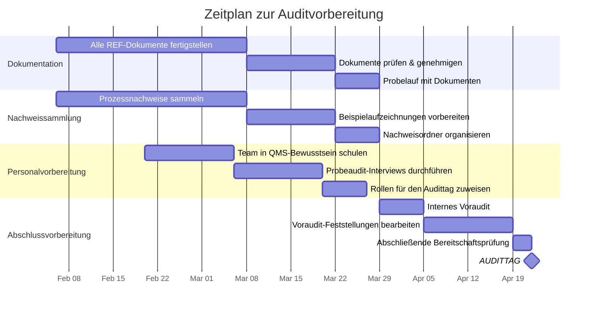

# Checkliste zur Auditvorbereitung

## DDD-Einheit — ISO 9001:2015 Zertifizierungsaudit

**Auditdatum:** JJJJ-MM-TT
**Zertifizierungsstelle:** _[Name]_
**Leitender Auditor:** _[Name]_
**Interner Koordinator:** QMR — _[Name]_

---

## Zeitplan

---

## Phase 1: Dokumentationsbereitschaft (8–12 Wochen vor dem Audit)

### QMS-Grundlagendokumente

| Nr. | Dokument | Referenz | Verantwortlich | Status | Prüfdatum | Genehmigt |
|-----|----------|----------|----------------|:------:|:---------:|:---------:|
| 1 | Kontextanalyse (SWOT/PESTLE) | [REF-01](../qms-framework/context-analysis.md) | Unit Lead | ☐ Entwurf ☐ Prüfung ☐ Final | | ☐ |
| 2 | Stakeholder-Register | [REF-02](../qms-framework/stakeholder-register.md) | PO / QMR | ☐ Entwurf ☐ Prüfung ☐ Final | | ☐ |
| 3 | QMS-Geltungsbereich | [REF-03](../qms-framework/qms-scope.md) | QMR | ☐ Entwurf ☐ Prüfung ☐ Final | | ☐ |
| 4 | Qualitätspolitik | [REF-04](../qms-framework/quality-policy.md) | Unit Lead | ☐ Entwurf ☐ Prüfung ☐ Final | | ☐ |
| 5 | RACI-Matrix | [REF-05](../qms-framework/raci-matrix.md) | QMR | ☐ Entwurf ☐ Prüfung ☐ Final | | ☐ |
| 6 | Risikoregister | [REF-06](../planning/risk-register.md) | QMR | ☐ Entwurf ☐ Prüfung ☐ Final | | ☐ |
| 7 | Qualitätsziele | [REF-07](../planning/quality-objectives.md) | QMR | ☐ Entwurf ☐ Prüfung ☐ Final | | ☐ |
| 8 | Kompetenzmatrix | [REF-08](../support/competency-matrix.md) | Team Leads | ☐ Entwurf ☐ Prüfung ☐ Final | | ☐ |
| 9 | Kommunikationsmatrix | [REF-09](../support/communication-matrix.md) | QMR | ☐ Entwurf ☐ Prüfung ☐ Final | | ☐ |
| 10 | Lieferantenbewertung | [REF-10](../operations/supplier-evaluation.md) | Tech Lead | ☐ Entwurf ☐ Prüfung ☐ Final | | ☐ |
| 11 | Internes Auditprogramm | [REF-11](../performance/internal-audit-program.md) | QMR | ☐ Entwurf ☐ Prüfung ☐ Final | | ☐ |
| 12 | Managementbewertungs-Vorlage | [REF-12](../performance/management-review.md) | QMR | ☐ Entwurf ☐ Prüfung ☐ Final | | ☐ |
| 13 | CAPA-Protokoll | [REF-13](../improvement/capa-log.md) | QMR | ☐ Entwurf ☐ Prüfung ☐ Final | | ☐ |
| 14 | QMS-Prozesslandkarte | [QMS-Prozesslandkarte](process-map.md) | QMR | ☐ Entwurf ☐ Prüfung ☐ Final | | ☐ |

### Zusätzlich benötigte Dokumente

| Nr. | Dokument | Beschreibung | Verantwortlich | Status |
|-----|----------|--------------|----------------|:------:|
| 15 | Verfahren zur Dokumentenlenkung | Wie Dokumente erstellt, geprüft, genehmigt und gelenkt werden | QMR | ☐ |
| 16 | Änderungsmanagement-Verfahren | RFC-Prozess, Genehmigungsstufen, Rollback | DevOps Lead | ☐ |
| 17 | Störungsmanagement-Verfahren | Schweregrade, Reaktionszeiten, Eskalation, Post-Mortem | SRE Lead | ☐ |
| 18 | Einarbeitungsverfahren | 30-60-90-Tage-Plan, QMS-Bewusstseinsschulung | Team Leads | ☐ |
| 19 | Datenschutz-Folgenabschätzung | GDPR-Konformität für Fahrdaten | DPO-Kontakt | ☐ |
| 20 | Werkzeugqualifizierungsplan (ISO 26262) | TCL-Bewertung für sicherheitsrelevante Werkzeuge | QA Lead | ☐ |

---

## Phase 2: Nachweissammlung (6–8 Wochen vor dem Audit)

### Checkliste Prozessnachweise

| ISO-Abschnitt | Erforderlicher Nachweis | Quelle | Gesammelt |
|:-------------:|-------------------------|--------|:---------:|
| **4.1** | Protokolle der Kontextbewertungssitzungen | Confluence | ☐ |
| **4.2** | Stakeholder-Feedback-Aufzeichnungen (NPS, Besprechungsnotizen) | Umfragetool, Confluence | ☐ |
| **5.1** | Nachweis des Managementengagements (Budgetfreigaben, Teilnahme an Bewertungen) | E-Mail, Jira | ☐ |
| **5.2** | Qualitätspolitik angezeigt und zur Kenntnis genommen | Confluence, Einarbeitungsunterlagen | ☐ |
| **5.3** | Rollendefinitionen, Organigramm, RACI | Confluence, HR-System | ☐ |
| **6.1** | Risikoregister mit Nachweisen der Überprüfungen | REF-06, Besprechungsprotokolle | ☐ |
| **6.2** | Messungen der Qualitätsziele (letzte 4 Quartale) | Grafana-Exporte, Berichte | ☐ |
| **7.1** | Ressourcenplanungsunterlagen, Infrastrukturdokumentation | Jira, Terraform-Repos | ☐ |
| **7.2** | Schulungsnachweise, Kompetenzbewertungen | SuccessFactors, Wiki | ☐ |
| **7.3** | Nachweise zum Qualitätsbewusstsein (All-Hands-Präsentationen, Einarbeitung) | Folien, Checklisten | ☐ |
| **7.4** | Kommunikationsaufzeichnungen (Sprint Reviews, Release Notes) | Confluence, E-Mail | ☐ |
| **7.5** | Nachweise zur Dokumentenlenkung (Versionshistorie, Genehmigungen) | Confluence, Git | ☐ |
| **8.1** | Sprint-Planungsunterlagen, Definition of Done | Jira, Confluence | ☐ |
| **8.2** | Anforderungen/User Stories mit Akzeptanzkriterien | Jira | ☐ |
| **8.3** | Designdokumentation (ADRs, Architekturdokumente) | Confluence, Git | ☐ |
| **8.3** | Code-Review-Aufzeichnungen (PR-Verlauf) | GitHub/GitLab | ☐ |
| **8.3** | Testergebnisse (CI/CD-Pipeline-Berichte) | CI/CD-Tool | ☐ |
| **8.4** | Lieferantenbewertungen, SLA-Überprüfungen | REF-10, Besprechungsnotizen | ☐ |
| **8.5** | Deployment-Aufzeichnungen, Release Notes | CI/CD, Confluence | ☐ |
| **8.5** | Monitoring-Dashboards (Verfügbarkeit, Leistung) | Grafana | ☐ |
| **8.7** | Fehler-/Störungsaufzeichnungen mit Lösung | Jira, PagerDuty | ☐ |
| **9.1** | KPI-Dashboard-Screenshots/-Exporte | Grafana | ☐ |
| **9.2** | Interne Auditberichte und Feststellungen | REF-11 | ☐ |
| **9.3** | Protokolle der Managementbewertung | REF-12 (abgeschlossen) | ☐ |
| **10.2** | CAPA-Aufzeichnungen (mindestens 3–5 vollständige Zyklen) | REF-13 | ☐ |
| **10.3** | Verbesserungsnachweise (Retrospektiven-Maßnahmen, Trenddaten) | Jira, Grafana | ☐ |

---

## Phase 3: Personalvorbereitung (4–6 Wochen vor dem Audit)

### Schulung zum Teambewusstsein

| Nr. | Aufgabe | Zielgruppe | Methode | Status |
|-----|---------|------------|---------|:------:|
| 1 | ISO 9001-Grundlagen & unser QMS-Überblick | Alle Teammitglieder | Workshop (1 Std.) | ☐ |
| 2 | Qualitätspolitik — kennen und erklären können | Alle Teammitglieder | All-Hands + Quiz | ☐ |
| 3 | Qualitätsziele — die eigenen KPIs kennen | Alle Teammitglieder | Teambesprechung | ☐ |
| 4 | „Was ist Ihre Rolle im QMS?" | Alle Teammitglieder | Einzelgespräch mit Team Lead | ☐ |
| 5 | Wie man Auditorfragen beantwortet | Interview-Kandidaten | Workshop (1 Std.) | ☐ |

### Probeaudit-Interviews

| Nr. | Rolle des Befragten | Abschnitt-Fokus | Interviewer | Datum | Bewertung | Nachverfolgung |
|-----|---------------------|:---------------:|-------------|:-----:|:---------:|----------------|
| 1 | Unit Lead | 5.1, 5.2, 9.3 | QMR | | /10 | |
| 2 | QMR | 4.3, 7.5, 9.2, 10.2 | Extern/bereichsübergreifend | | /10 | |
| 3 | Product Owner | 4.2, 8.2 | QMR | | /10 | |
| 4 | Tech Lead | 8.3, 8.4 | QMR | | /10 | |
| 5 | Scrum Master | 8.1, 10.1 | QMR | | /10 | |
| 6 | Entwickler | 7.2, 8.3, 8.5 | Team Lead | | /10 | |
| 7 | DevOps Engineer | 7.1, 8.5 | Team Lead | | /10 | |
| 8 | QA Engineer | 8.3, 8.7 | QMR | | /10 | |

### Rollenzuweisung am Audittag

| Rolle | Person | Verantwortung |
|-------|--------|---------------|
| **Begleiter / Lotse** | _[Name]_ | Begleitet den Auditor, organisiert die Logistik, achtet auf die Zeit |
| **Sprecher Abschnitt 4–5** | _[Unit Lead]_ | Beantwortet Fragen zu Kontext, Führung, Politik |
| **Sprecher Abschnitt 6** | _[QMR]_ | Beantwortet Fragen zu Risiken, Zielen, Planung |
| **Sprecher Abschnitt 7** | _[Team Lead / QMR]_ | Beantwortet Fragen zu Ressourcen, Kompetenz, Dokumenten |
| **Sprecher Abschnitt 8** | _[Tech Lead / PO]_ | Beantwortet Fragen zu Betrieb, Design, Entwicklung |
| **Sprecher Abschnitt 9–10** | _[QMR]_ | Beantwortet Fragen zu Messung, Audit, Verbesserung |
| **Systemvorführung** | _[DevOps Engineer]_ | Zeigt Jira, Confluence, CI/CD, Grafana live |
| **Protokollführer** | _[Name]_ | Erfasst alle Fragen und Kommentare des Auditors |

---

## Phase 4: Abschließende Bereitschaft (1–2 Wochen vor dem Audit)

| Nr. | Aufgabe | Verantwortlich | Status |
|-----|---------|----------------|:------:|
| 1 | Internes Voraudit durchführen (Mini-Audit aller Abschnitte) | QMR + Auditor | ☐ |
| 2 | Alle Feststellungen aus dem Voraudit bearbeiten | Jeweilige Verantwortliche | ☐ |
| 3 | Aktualität aller Dokumente sicherstellen (keine veralteten Inhalte) | QMR | ☐ |
| 4 | Alle KPI-Dashboards auf dem neuesten Stand bringen | DevOps | ☐ |
| 5 | Konferenzraum vorbereiten (Beamer, Whiteboard, Dokumente) | Begleiter | ☐ |
| 6 | Schlüsseldokumente drucken (Qualitätspolitik, Geltungsbereich, Prozesslandkarte) | QMR | ☐ |
| 7 | Systemzugang testen (Jira, Confluence, Git, Grafana vorführbar) | Systemvorführer | ☐ |
| 8 | Alle Sprecher einweisen — finaler Durchlauf | QMR | ☐ |
| 9 | Eröffnungspräsentation vorbereiten (Einheitsübersicht, 10 Min.) | Unit Lead | ☐ |
| 10 | Team über Auditplan und Erwartungen informieren | QMR | ☐ |

---

## Checkliste für den Audittag

### Vormittag — Eröffnung

- [ ] Auditor begrüßen, Vorstellungsrunde
- [ ] Unit Lead präsentiert 10-minütige Übersicht (Wer sind wir, was machen wir, QMS-Geltungsbereich)
- [ ] Auditplan und Zeitplan bestätigen
- [ ] WLAN-Zugang bereitstellen, Raumlogistik klären

### Während des Audits — Interviewrunden

- [ ] Auditor zwischen den Sitzungen begleiten
- [ ] Protokollführer erfasst alle Fragen und Kommentare
- [ ] Bei Unsicherheit bei einer Antwort: „Ich besorge Ihnen diese Information" (und sie dann tatsächlich besorgen)
- [ ] Antworten kurz und nachweisbasiert halten
- [ ] Systeme geöffnet und bereit für Live-Vorführungen halten

### Nachmittag — Abschluss

- [ ] An der Abschlussbesprechung teilnehmen (alle Sprecher)
- [ ] Feststellungen anhören — nicht widersprechen, bei Bedarf um Klarstellung bitten
- [ ] Dem Auditor danken
- [ ] Interne Nachbesprechung unmittelbar danach — alle Beobachtungen festhalten
- [ ] CAPA-Einträge für alle Feststellungen erstellen

---

## Maßnahmen nach dem Audit

| Nr. | Aufgabe | Verantwortlich | Fälligkeitsdatum | Status |
|-----|---------|----------------|:-----------------:|:------:|
| 1 | Auditbericht an das Management verteilen | QMR | +1 Woche | ☐ |
| 2 | CAPA für jede Feststellung erstellen | QMR | +2 Wochen | ☐ |
| 3 | Ursachenanalyse für wesentliche Feststellungen | Feststellungsverantwortliche | +3 Wochen | ☐ |
| 4 | Korrekturmaßnahmen umsetzen | Feststellungsverantwortliche | Gem. CAPA | ☐ |
| 5 | Wirksamkeit der Korrekturen verifizieren | QMR | Gem. CAPA | ☐ |
| 6 | Nachweise an Zertifizierungsstelle übermitteln (falls erforderlich) | QMR | Gem. Frist | ☐ |
| 7 | Lessons-Learned-Sitzung | QMR + alle | +4 Wochen | ☐ |
| 8 | QMS-Dokumente auf Basis der Lessons Learned aktualisieren | QMR | +6 Wochen | ☐ |

---

*Dokumentversion: 1.0 | Erstellt: 06.02.2026 | Verantwortlich: QMR, DDD-Einheit*
