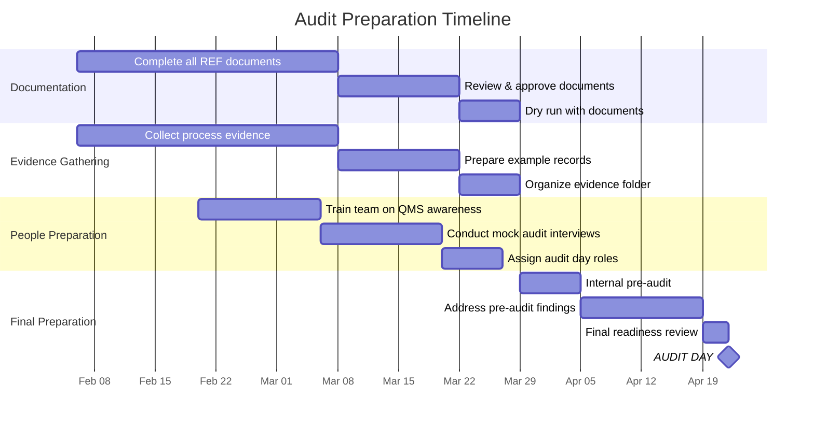

# Audit Preparation Checklist

## DDD Unit — ISO 9001:2015 Certification Audit

**Audit Date:** YYYY-MM-DD
**Auditing Body:** _[Name]_
**Lead Auditor:** _[Name]_
**Internal Coordinator:** QMR — _[Name]_

---

## Timeline

---

## Phase 1: Documentation Readiness (8-12 weeks before audit)

### QMS Foundation Documents

| # | Document | Reference | Owner | Status | Review Date | Approved |
|---|----------|-----------|-------|:------:|:-----------:|:--------:|
| 1 | Context Analysis (SWOT/PESTLE) | [REF-01](reference-documents/REF-01-Context-Analysis.md) | Unit Lead | ☐ Draft ☐ Review ☐ Final | | ☐ |
| 2 | Stakeholder Register | [REF-02](reference-documents/REF-02-Stakeholder-Register.md) | PO / QMR | ☐ Draft ☐ Review ☐ Final | | ☐ |
| 3 | QMS Scope Statement | [REF-03](reference-documents/REF-03-QMS-Scope.md) | QMR | ☐ Draft ☐ Review ☐ Final | | ☐ |
| 4 | Quality Policy | [REF-04](reference-documents/REF-04-Quality-Policy.md) | Unit Lead | ☐ Draft ☐ Review ☐ Final | | ☐ |
| 5 | RACI Matrix | [REF-05](reference-documents/REF-05-RACI-Matrix.md) | QMR | ☐ Draft ☐ Review ☐ Final | | ☐ |
| 6 | Risk Register | [REF-06](reference-documents/REF-06-Risk-Register.md) | QMR | ☐ Draft ☐ Review ☐ Final | | ☐ |
| 7 | Quality Objectives | [REF-07](reference-documents/REF-07-Quality-Objectives.md) | QMR | ☐ Draft ☐ Review ☐ Final | | ☐ |
| 8 | Competency Matrix | [REF-08](reference-documents/REF-08-Competency-Matrix.md) | Team Leads | ☐ Draft ☐ Review ☐ Final | | ☐ |
| 9 | Communication Matrix | [REF-09](reference-documents/REF-09-Communication-Matrix.md) | QMR | ☐ Draft ☐ Review ☐ Final | | ☐ |
| 10 | Supplier Evaluation | [REF-10](reference-documents/REF-10-Supplier-Evaluation.md) | Tech Lead | ☐ Draft ☐ Review ☐ Final | | ☐ |
| 11 | Internal Audit Program | [REF-11](reference-documents/REF-11-Internal-Audit-Program.md) | QMR | ☐ Draft ☐ Review ☐ Final | | ☐ |
| 12 | Management Review Template | [REF-12](reference-documents/REF-12-Management-Review-Template.md) | QMR | ☐ Draft ☐ Review ☐ Final | | ☐ |
| 13 | CAPA Log | [REF-13](reference-documents/REF-13-CAPA-Log.md) | QMR | ☐ Draft ☐ Review ☐ Final | | ☐ |
| 14 | QMS Process Map | [QMS Process Map](QMS-Process-Map.md) | QMR | ☐ Draft ☐ Review ☐ Final | | ☐ |

### Additional Documents Needed

| # | Document | Description | Owner | Status |
|---|----------|-------------|-------|:------:|
| 15 | Document Control Procedure | How documents are created, reviewed, approved, and controlled | QMR | ☐ |
| 16 | Change Management Procedure | RFC process, approval levels, rollback | DevOps Lead | ☐ |
| 17 | Incident Management Procedure | Severity levels, response times, escalation, post-mortem | SRE Lead | ☐ |
| 18 | Onboarding Procedure | 30-60-90 day plan, QMS awareness training | Team Leads | ☐ |
| 19 | Data Protection Impact Assessment | GDPR compliance for driving data | DPO liaison | ☐ |
| 20 | Tool Qualification Plan (ISO 26262) | TCL assessment for safety-relevant tools | QA Lead | ☐ |

---

## Phase 2: Evidence Collection (6-8 weeks before audit)

### Process Evidence Checklist

| ISO Clause | Evidence Required | Source | Collected |
|:----------:|-------------------|--------|:---------:|
| **4.1** | Context review meeting minutes | Confluence | ☐ |
| **4.2** | Stakeholder feedback records (NPS, meeting notes) | Survey tool, Confluence | ☐ |
| **5.1** | Management commitment evidence (budget approvals, review participation) | Email, Jira | ☐ |
| **5.2** | Quality policy displayed and acknowledged | Confluence, onboarding records | ☐ |
| **5.3** | Role definitions, org chart, RACI | Confluence, HR system | ☐ |
| **6.1** | Risk register with evidence of reviews | REF-06, meeting minutes | ☐ |
| **6.2** | Quality objective measurements (last 4 quarters) | Grafana exports, reports | ☐ |
| **7.1** | Resource planning records, infrastructure documentation | Jira, Terraform repos | ☐ |
| **7.2** | Training records, competency assessments | SuccessFactors, wiki | ☐ |
| **7.3** | Quality awareness evidence (all-hands slides, onboarding) | Slides, checklists | ☐ |
| **7.4** | Communication records (sprint reviews, release notes) | Confluence, email | ☐ |
| **7.5** | Document control evidence (version history, approvals) | Confluence, Git | ☐ |
| **8.1** | Sprint planning records, Definition of Done | Jira, Confluence | ☐ |
| **8.2** | Requirements/user stories with acceptance criteria | Jira | ☐ |
| **8.3** | Design documentation (ADRs, architecture docs) | Confluence, Git | ☐ |
| **8.3** | Code review records (PR history) | GitHub/GitLab | ☐ |
| **8.3** | Test results (CI/CD pipeline reports) | CI/CD tool | ☐ |
| **8.4** | Supplier evaluations, SLA reviews | REF-10, meeting notes | ☐ |
| **8.5** | Deployment records, release notes | CI/CD, Confluence | ☐ |
| **8.5** | Monitoring dashboards (uptime, performance) | Grafana | ☐ |
| **8.7** | Bug/incident records with resolution | Jira, PagerDuty | ☐ |
| **9.1** | KPI dashboard screenshots/exports | Grafana | ☐ |
| **9.2** | Internal audit reports and findings | REF-11 | ☐ |
| **9.3** | Management review meeting minutes | REF-12 (completed) | ☐ |
| **10.2** | CAPA records (at least 3-5 complete cycles) | REF-13 | ☐ |
| **10.3** | Improvement evidence (retrospective actions, trend data) | Jira, Grafana | ☐ |

---

## Phase 3: People Preparation (4-6 weeks before audit)

### Team Awareness Training

| # | Task | Audience | Method | Status |
|---|------|----------|--------|:------:|
| 1 | ISO 9001 basics & our QMS overview | All team members | Workshop (1h) | ☐ |
| 2 | Quality policy — know it, explain it | All team members | All-hands + quiz | ☐ |
| 3 | Quality objectives — know your KPIs | All team members | Team meeting | ☐ |
| 4 | "What's your role in the QMS?" | All team members | 1:1 with team lead | ☐ |
| 5 | How to handle auditor questions | Interview candidates | Workshop (1h) | ☐ |

### Mock Audit Interviews

| # | Interviewee Role | Clause Focus | Interviewer | Date | Score | Follow-up |
|---|-----------------|:------------:|-------------|:----:|:-----:|-----------|
| 1 | Unit Lead | 5.1, 5.2, 9.3 | QMR | | /10 | |
| 2 | QMR | 4.3, 7.5, 9.2, 10.2 | External/cross-unit | | /10 | |
| 3 | Product Owner | 4.2, 8.2 | QMR | | /10 | |
| 4 | Tech Lead | 8.3, 8.4 | QMR | | /10 | |
| 5 | Scrum Master | 8.1, 10.1 | QMR | | /10 | |
| 6 | Developer | 7.2, 8.3, 8.5 | Team Lead | | /10 | |
| 7 | DevOps Engineer | 7.1, 8.5 | Team Lead | | /10 | |
| 8 | QA Engineer | 8.3, 8.7 | QMR | | /10 | |

### Audit Day Role Assignments

| Role | Person | Responsibility |
|------|--------|---------------|
| **Escort / Guide** | _[Name]_ | Accompanies auditor, manages logistics, time-keeping |
| **Clause 4-5 Spokesperson** | _[Unit Lead]_ | Answers on context, leadership, policy |
| **Clause 6 Spokesperson** | _[QMR]_ | Answers on risk, objectives, planning |
| **Clause 7 Spokesperson** | _[Team Lead / QMR]_ | Answers on resources, competence, documents |
| **Clause 8 Spokesperson** | _[Tech Lead / PO]_ | Answers on operations, design, development |
| **Clause 9-10 Spokesperson** | _[QMR]_ | Answers on measurement, audit, improvement |
| **System Demo** | _[DevOps Engineer]_ | Shows Jira, Confluence, CI/CD, Grafana live |
| **Note Taker** | _[Name]_ | Records all auditor questions and comments |

---

## Phase 4: Final Readiness (1-2 weeks before audit)

| # | Task | Owner | Status |
|---|------|-------|:------:|
| 1 | Conduct internal pre-audit (mini-audit of all clauses) | QMR + auditor | ☐ |
| 2 | Address all findings from pre-audit | Respective owners | ☐ |
| 3 | Verify all documents are current (no stale content) | QMR | ☐ |
| 4 | Ensure all KPI dashboards are up-to-date | DevOps | ☐ |
| 5 | Prepare conference room (projector, whiteboard, documents) | Escort | ☐ |
| 6 | Print key documents (Quality Policy, Scope, Process Map) | QMR | ☐ |
| 7 | Test system access (can show Jira, Confluence, Git, Grafana) | System Demo person | ☐ |
| 8 | Brief all spokespersons — final run-through | QMR | ☐ |
| 9 | Prepare opening presentation (unit overview, 10 min) | Unit Lead | ☐ |
| 10 | Notify team of audit schedule and expectations | QMR | ☐ |

---

## Audit Day Checklist

### Morning — Opening

- [ ] Welcome auditor, introductions
- [ ] Unit Lead presents 10-min overview (who we are, what we do, QMS scope)
- [ ] Confirm audit plan and schedule
- [ ] Provide WiFi access, room logistics

### During — Interview Sessions

- [ ] Escort auditor between sessions
- [ ] Note taker records all questions and comments
- [ ] If unsure about an answer: "Let me get you that information" (then actually get it)
- [ ] Keep answers concise and evidence-based
- [ ] Have systems open and ready for live demonstrations

### Afternoon — Closing

- [ ] Attend closing meeting (all spokespersons)
- [ ] Listen to findings — don't argue, ask for clarification if needed
- [ ] Thank the auditor
- [ ] Internal debrief immediately after — capture all observations
- [ ] Create CAPA entries for any findings

---

## Post-Audit Actions

| # | Task | Owner | Due Date | Status |
|---|------|-------|:--------:|:------:|
| 1 | Distribute audit report to management | QMR | +1 week | ☐ |
| 2 | Create CAPA for each finding | QMR | +2 weeks | ☐ |
| 3 | Root cause analysis for major findings | Finding owners | +3 weeks | ☐ |
| 4 | Implement corrective actions | Finding owners | Per CAPA | ☐ |
| 5 | Verify effectiveness of corrections | QMR | Per CAPA | ☐ |
| 6 | Submit evidence to certification body (if required) | QMR | Per deadline | ☐ |
| 7 | Lessons learned session | QMR + all | +4 weeks | ☐ |
| 8 | Update QMS documents based on lessons learned | QMR | +6 weeks | ☐ |

---

*Document Version: 1.0 | Created: 2026-02-06 | Owner: QMR, DDD Unit*
