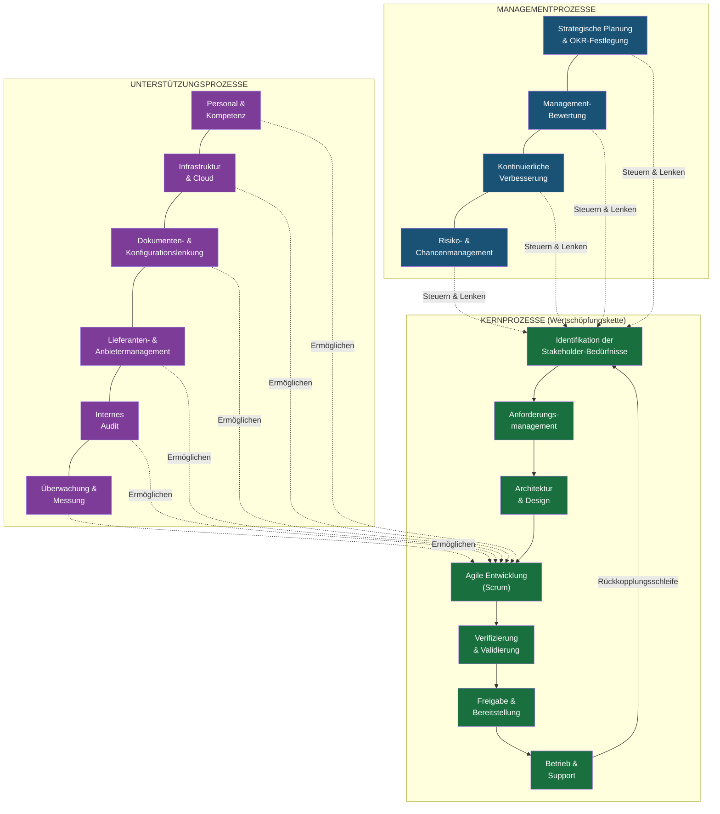
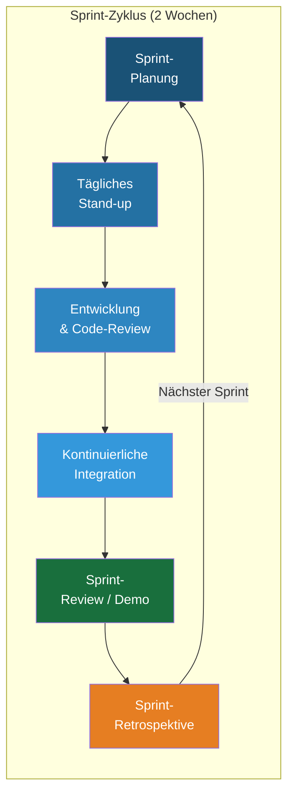
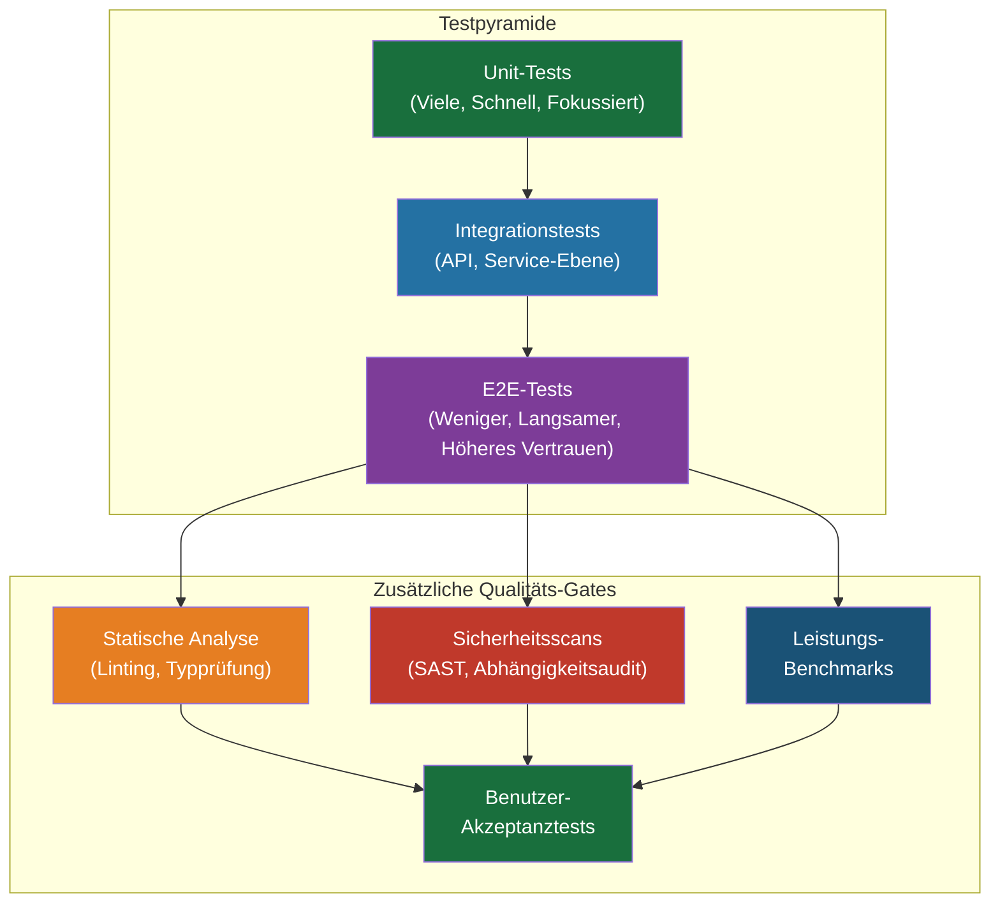
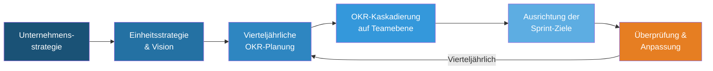

# QMS-Prozesslandkarte — DDD-Einheit

## Data Driven Development | AD/ADAS Tooling

---

## 1. Übersicht der Prozesslandschaft

Unsere QMS-Prozesse sind in drei Ebenen organisiert: **Management-**, **Kern- (wertschöpfende)** und **Unterstützungsprozesse**.

---

## 2. Details der Kernprozesse

### 2.1 Identifikation der Stakeholder-Bedürfnisse

| Attribut | Beschreibung |
|----------|--------------|
| **Verantwortlicher** | Product Owner |
| **Eingaben** | Kundenfeedback, NPS-Umfragen, Roadmap-Anfragen, Vorfalltrends, regulatorische Änderungen |
| **Aktivitäten** | Stakeholder-Interviews, Umfrageanalyse, Backlog-Pflege, OKR-Abstimmung |
| **Ergebnisse** | Priorisiertes Backlog, aktualisiertes Stakeholder-Register, Roadmap |
| **KPIs** | Reaktionszeit auf Feature-Anfragen, Aktualität des Backlogs |
| **ISO 9001 Abschnitt** | 4.2, 8.2 |

### 2.2 Anforderungsmanagement

| Attribut | Beschreibung |
|----------|--------------|
| **Verantwortlicher** | Product Owner + Tech Lead |
| **Eingaben** | Priorisiertes Backlog, technische Einschränkungen, Architekturrichtlinien |
| **Aktivitäten** | Erstellung von User Stories, Definition von Akzeptanzkriterien, Verfeinerungssitzungen, Machbarkeitsanalyse |
| **Ergebnisse** | Verfeinerte User Stories mit Akzeptanzkriterien, technische Spezifikationen |
| **KPIs** | Ablehnungsrate von Stories bei der Überprüfung, Bewertung der Anforderungsklarheit |
| **ISO 9001 Abschnitt** | 8.2, 8.3 |

### 2.3 Architektur & Design

| Attribut | Beschreibung |
|----------|--------------|
| **Verantwortlicher** | Tech Lead / Architekt |
| **Eingaben** | Verfeinerte Anforderungen, nicht-funktionale Anforderungen, Tech-Radar |
| **Aktivitäten** | Architecture Decision Records (ADRs), Design-Reviews, Prototyping, Bedrohungsmodellierung |
| **Ergebnisse** | ADRs, Systemdesign-Dokumente, API-Spezifikationen, Sicherheitsbewertung |
| **KPIs** | ADR-Abdeckung bei wesentlichen Änderungen, Abschlussrate von Design-Reviews |
| **ISO 9001 Abschnitt** | 8.3 |

### 2.4 Agile Entwicklung (Scrum)

| Attribut | Beschreibung |
|----------|--------------|
| **Verantwortlicher** | Scrum Master + Entwicklungsteam |
| **Eingaben** | Sprint-Backlog, Codierungsstandards, Branch-Strategie |
| **Aktivitäten** | Sprint-Planung, tägliche Stand-ups, Programmierung, Pair Programming, Code-Review |
| **Ergebnisse** | Getesteter Code in Feature-Branches, PR-Reviews, aktualisierte Dokumentation |
| **KPIs** | Velocity, Sprint-Zielerreichungsrate, Bearbeitungszeit für Code-Reviews |
| **ISO 9001 Abschnitt** | 8.3, 8.5 |

### 2.5 Verifizierung & Validierung

| Attribut | Beschreibung |
|----------|--------------|
| **Verantwortlicher** | QA / Entwicklungsteam |
| **Eingaben** | Codeänderungen, Akzeptanzkriterien, Testpläne |
| **Aktivitäten** | Unit-Tests, Integrationstests, E2E-Tests, Leistungstests, Sicherheitsscans, Benutzerakzeptanztests |
| **Ergebnisse** | Testberichte, Abdeckungsmetriken, Ergebnisse der Sicherheitsscans, UAT-Freigabe |
| **KPIs** | Testabdeckung (≥80%), Fehler-Escape-Rate, Testbestehensrate |
| **ISO 9001 Abschnitt** | 8.3, 8.5, 8.7 |

### 2.6 Freigabe & Bereitstellung

| Attribut | Beschreibung |
|----------|--------------|
| **Verantwortlicher** | DevOps / Release-Manager |
| **Eingaben** | Getestete Artefakte, Release Notes, Bereitstellungshandbuch |
| **Aktivitäten** | Staging-Bereitstellung, Smoke-Tests, Canary-/Blue-Green-Produktionsbereitstellung, Rollback-Bereitschaft |
| **Ergebnisse** | Produktionsfreigabe, Release Notes, Bereitstellungsaufzeichnungen |
| **KPIs** | Bereitstellungsfrequenz, Bereitstellungsfehlerrate, Rollback-Rate |
| **ISO 9001 Abschnitt** | 8.5, 8.7 |

### 2.7 Betrieb & Support

| Attribut | Beschreibung |
|----------|--------------|
| **Verantwortlicher** | Betrieb / SRE-Team |
| **Eingaben** | Produktionssysteme, Überwachungsalarme, Kundensupportanfragen |
| **Aktivitäten** | Vorfallmanagement, SLA-Überwachung, Kapazitätsplanung, Patching, Kundensupport |
| **Ergebnisse** | Vorfallberichte, SLA-Berichte, Kapazitätspläne, Kundenlösungen |
| **KPIs** | Verfügbarkeit (≥99,5%), MTTR, Vorfallwiederholungsrate, Bearbeitungszeit für Supporttickets |
| **ISO 9001 Abschnitt** | 8.5, 9.1 |

---

## 3. Details der Managementprozesse

### 3.1 Strategische Planung & OKR-Festlegung

### 3.2 Risiko- & Chancenmanagement

| Attribut | Beschreibung |
|----------|--------------|
| **Verantwortlicher** | QMB + Einheitsleiter |
| **Häufigkeit** | Vierteljährliche Überprüfung, kontinuierliche Identifikation |
| **Methode** | 5×5-Risikomatrix, FMEA für kritische Komponenten |
| **Aufzeichnungen** | Risikoregister (REF-06) |
| **ISO 9001 Abschnitt** | 6.1 |

---

## 4. Prozess-Interaktionsmatrix

Diese Matrix zeigt, wie die Prozesse miteinander interagieren:

| Prozess ↓ speist in → | Anf.-Mgmt. | Design | Entw. | V&V | Freigabe | Betrieb | Mgmt-Bewertung |
|------------------------|:----------:|:------:|:-----:|:---:|:--------:|:-------:|:--------------:|
| **Bedarfsermittlung** | ● | | | | | | ● |
| **Anforderungsmgmt.** | | ● | | | | | |
| **Design** | | | ● | | | | |
| **Entwicklung** | | | | ● | | | |
| **V&V** | | | ○ | | ● | | ● |
| **Freigabe** | | | | | | ● | ● |
| **Betrieb** | ● | | | | | | ● |
| **Risikomanagement** | ● | ● | | ● | | | ● |

● = Primäre Eingabe | ○ = Rückkopplungsschleife

---

## 5. Zusammenfassung der Prozessverantwortung

| Prozess | Verantwortliche Rolle | ISO 9001 Abschnitt |
|---------|-----------------------|--------------------|
| Strategische Planung | Einheitsleiter | 5.1, 6.2 |
| Management-Bewertung | Einheitsleiter + QMB | 9.3 |
| Risikomanagement | QMB | 6.1 |
| Kontinuierliche Verbesserung | QMB | 10.1, 10.3 |
| Bedarfsermittlung | Product Owner | 4.2, 8.2 |
| Anforderungsmanagement | Product Owner + Tech Lead | 8.2, 8.3 |
| Architektur & Design | Tech Lead | 8.3 |
| Agile Entwicklung | Scrum Master + Team | 8.3, 8.5 |
| Verifizierung & Validierung | QA-Leiter | 8.3, 8.7 |
| Freigabe & Bereitstellung | DevOps-Leiter | 8.5 |
| Betrieb & Support | SRE/Ops-Leiter | 8.5, 9.1 |
| Personal & Kompetenz | Teamleiter + HR | 7.1, 7.2 |
| Infrastruktur | DevOps-Leiter | 7.1 |
| Dokumentenlenkung | QMB | 7.5 |
| Lieferantenmanagement | Beschaffung + Tech Lead | 8.4 |
| Internes Audit | QMB (Unabhängigkeit erforderlich) | 9.2 |

---

*Dokumentversion: 1.0 | Erstellt: 06.02.2026 | Verantwortlich: QMB, DDD-Einheit*
