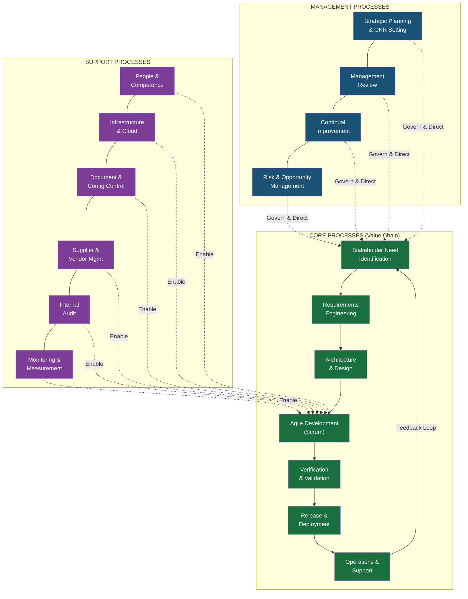
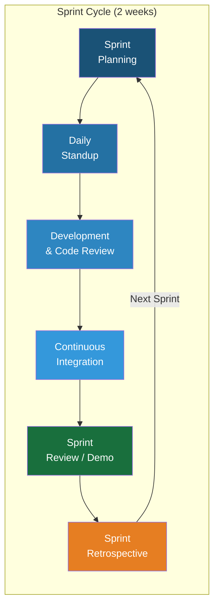
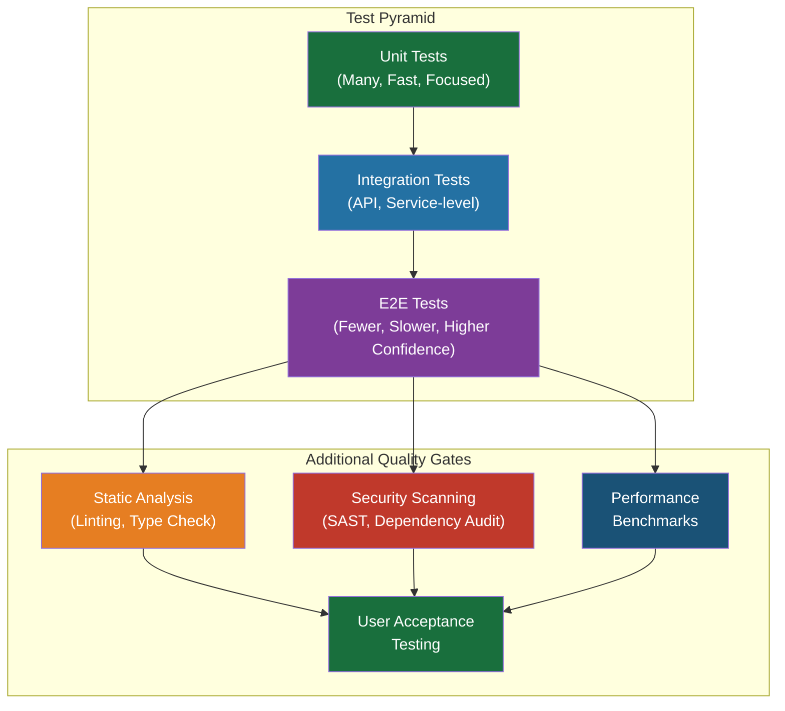
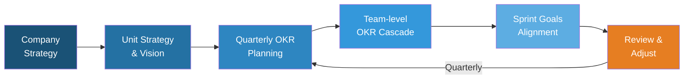

# QMS Process Map — DDD Unit

## Data Driven Development | AD/ADAS Tooling

---

## 1. Process Landscape Overview

Our QMS processes are organized into three tiers: **Management**, **Core (Value-Creating)**, and **Support** processes.

---

## 2. Core Process Details

### 2.1 Stakeholder Need Identification

| Attribute | Description |
|-----------|-------------|
| **Owner** | Product Owner |
| **Inputs** | Customer feedback, NPS surveys, roadmap requests, incident trends, regulatory changes |
| **Activities** | Stakeholder interviews, survey analysis, backlog grooming, OKR alignment |
| **Outputs** | Prioritized backlog, updated stakeholder register, roadmap |
| **KPIs** | Feature request response time, backlog freshness |
| **ISO 9001 Clause** | 4.2, 8.2 |

### 2.2 Requirements Engineering

| Attribute | Description |
|-----------|-------------|
| **Owner** | Product Owner + Tech Lead |
| **Inputs** | Prioritized backlog, technical constraints, architectural guidelines |
| **Activities** | User story writing, acceptance criteria definition, refinement sessions, feasibility analysis |
| **Outputs** | Refined user stories with acceptance criteria, technical specifications |
| **KPIs** | Story rejection rate at review, requirement clarity score |
| **ISO 9001 Clause** | 8.2, 8.3 |

### 2.3 Architecture & Design

| Attribute | Description |
|-----------|-------------|
| **Owner** | Tech Lead / Architect |
| **Inputs** | Refined requirements, non-functional requirements, tech radar |
| **Activities** | Architecture decision records (ADRs), design reviews, prototyping, threat modeling |
| **Outputs** | ADRs, system design documents, API specifications, security assessment |
| **KPIs** | ADR coverage for significant changes, design review completion rate |
| **ISO 9001 Clause** | 8.3 |

### 2.4 Agile Development (Scrum)

| Attribute | Description |
|-----------|-------------|
| **Owner** | Scrum Master + Development Team |
| **Inputs** | Sprint backlog, coding standards, branch strategy |
| **Activities** | Sprint planning, daily standups, coding, pair programming, code review |
| **Outputs** | Tested code in feature branches, PR reviews, updated documentation |
| **KPIs** | Velocity, sprint goal completion rate, code review turnaround time |
| **ISO 9001 Clause** | 8.3, 8.5 |

### 2.5 Verification & Validation

| Attribute | Description |
|-----------|-------------|
| **Owner** | QA / Development Team |
| **Inputs** | Code changes, acceptance criteria, test plans |
| **Activities** | Unit testing, integration testing, E2E testing, performance testing, security scanning, user acceptance testing |
| **Outputs** | Test reports, coverage metrics, security scan results, UAT sign-off |
| **KPIs** | Test coverage (≥80%), defect escape rate, test pass rate |
| **ISO 9001 Clause** | 8.3, 8.5, 8.7 |

### 2.6 Release & Deployment

| Attribute | Description |
|-----------|-------------|
| **Owner** | DevOps / Release Manager |
| **Inputs** | Tested artifacts, release notes, deployment runbook |
| **Activities** | Staging deployment, smoke testing, canary/blue-green production deployment, rollback readiness |
| **Outputs** | Production release, release notes, deployment records |
| **KPIs** | Deployment frequency, deployment failure rate, rollback rate |
| **ISO 9001 Clause** | 8.5, 8.7 |

### 2.7 Operations & Support

| Attribute | Description |
|-----------|-------------|
| **Owner** | Operations / SRE Team |
| **Inputs** | Production systems, monitoring alerts, customer support requests |
| **Activities** | Incident management, SLA monitoring, capacity planning, patching, customer support |
| **Outputs** | Incident reports, SLA reports, capacity plans, customer resolutions |
| **KPIs** | Uptime (≥99.5%), MTTR, incident recurrence rate, support ticket resolution time |
| **ISO 9001 Clause** | 8.5, 9.1 |

---

## 3. Management Process Details

### 3.1 Strategic Planning & OKR Setting

### 3.2 Risk & Opportunity Management

| Attribute | Description |
|-----------|-------------|
| **Owner** | QMR + Unit Lead |
| **Frequency** | Quarterly review, continuous identification |
| **Method** | 5×5 risk matrix, FMEA for critical components |
| **Records** | Risk Register (REF-06) |
| **ISO 9001 Clause** | 6.1 |

---

## 4. Process Interaction Matrix

This matrix shows how processes interact with each other:

| Process ↓ feeds into → | Req. Eng. | Design | Dev | V&V | Release | Ops | Mgmt Review |
|-------------------------|:---------:|:------:|:---:|:---:|:-------:|:---:|:-----------:|
| **Need Identification** | ● | | | | | | ● |
| **Requirements Eng.** | | ● | | | | | |
| **Design** | | | ● | | | | |
| **Development** | | | | ● | | | |
| **V&V** | | | ○ | | ● | | ● |
| **Release** | | | | | | ● | ● |
| **Operations** | ● | | | | | | ● |
| **Risk Mgmt** | ● | ● | | ● | | | ● |

● = Primary input | ○ = Feedback loop

---

## 5. Process Ownership Summary

| Process | Owner Role | ISO 9001 Clause |
|---------|-----------|-----------------|
| Strategic Planning | Unit Lead | 5.1, 6.2 |
| Management Review | Unit Lead + QMR | 9.3 |
| Risk Management | QMR | 6.1 |
| Continual Improvement | QMR | 10.1, 10.3 |
| Need Identification | Product Owner | 4.2, 8.2 |
| Requirements Engineering | Product Owner + Tech Lead | 8.2, 8.3 |
| Architecture & Design | Tech Lead | 8.3 |
| Agile Development | Scrum Master + Team | 8.3, 8.5 |
| Verification & Validation | QA Lead | 8.3, 8.7 |
| Release & Deployment | DevOps Lead | 8.5 |
| Operations & Support | SRE/Ops Lead | 8.5, 9.1 |
| People & Competence | Team Leads + HR | 7.1, 7.2 |
| Infrastructure | DevOps Lead | 7.1 |
| Document Control | QMR | 7.5 |
| Supplier Management | Procurement + Tech Lead | 8.4 |
| Internal Audit | QMR (independence required) | 9.2 |

---

*Document Version: 1.0 | Created: 2026-02-06 | Owner: QMR, DDD Unit*
