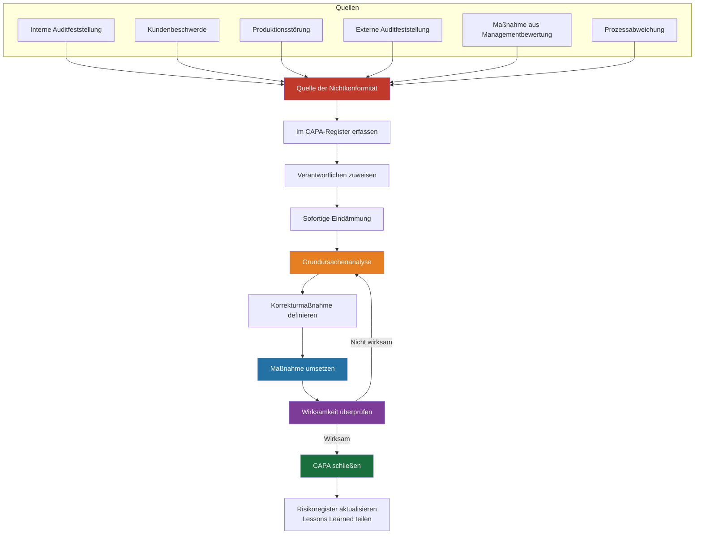

# REF-13: Korrektur- und Vorbeugemaßnahmen (CAPA) — Protokoll

## DDD-Einheit — Data Driven Development | AD/ADAS Tooling

**Dokumentenverantwortlicher:** Qualitätsmanagementbeauftragter (QMB)
**Letzte Überprüfung:** TT.MM.JJJJ
**Überprüfungshäufigkeit:** Monatlich

---

## 1. Zweck

Verfolgt alle Korrektur- und Vorbeugemaßnahmen aus Nichtkonformitäten, Auditfeststellungen, Kundenbeschwerden und Störungen, wie von ISO 9001:2015 Abschnitt 10.2 gefordert.

---

## 2. CAPA-Prozess

---

## 3. Methoden der Grundursachenanalyse

| Methode | Anwendungsfall | Beschreibung |
|--------|------------|-------------|
| **5-Warum** | Die meisten Nichtkonformitäten | Iterativ „Warum?" fragen, bis die Grundursache gefunden ist |
| **Fischgräten-Diagramm (Ishikawa)** | Komplexe Probleme mit mehreren möglichen Ursachen | Ursachen kategorisieren: Mensch, Prozess, Technik, Umgebung |
| **Fehlerbaumanalyse** | Kritische/sicherheitsrelevante Probleme | Top-down deduktive Analyse |
| **Zeitachsenanalyse** | Störungen mit komplexem Ereignisverlauf | Ereignisse chronologisch abbilden, um den Auslöser zu finden |

---

## 4. CAPA-Register

| CAPA-Nr. | Eröffnungsdatum | Quelle | Beschreibung | Schweregrad | Grundursachen-Methode | Grundursache | Sofortmaßnahme | Korrekturmaßnahme | Verantwortlich | Fälligkeitsdatum | Status | Datum der Wirksamkeitsprüfung | Wirksam? | Abschlussdatum |
|:------:|:----------:|:------:|-------------|:--------:|:-----------------:|------------|-------------------|-------------------|-------|:--------:|:------:|:------------------------:|:----------:|:-----------:|
| CA-001 | TT.MM.JJJJ | _[Quelle]_ | _[Beschreibung der Nichtkonformität]_ | Kritisch / Schwer / Leicht | 5-Warum | _[Grundursache]_ | _[Ergriffene Sofortmaßnahme]_ | _[Korrekturmaßnahme]_ | _[Name]_ | TT.MM.JJJJ | ☐ Offen | TT.MM.JJJJ | ☐ Ja / ☐ Nein | TT.MM.JJJJ |
| CA-002 | | | | | | | | | | | | | | |
| CA-003 | | | | | | | | | | | | | | |

---

## 5. Beispiel-CAPA-Eintrag (als Referenz)

| Feld | Beispiel |
|-------|---------|
| **CAPA-Nr.** | CA-001 |
| **Eröffnungsdatum** | 15.01.2026 |
| **Quelle** | Produktionsstörung INC-2026-042 |
| **Beschreibung** | Wiederaufbereitungs-Pipeline erzeugte fehlerhafte Ausgaben für 3 Datensätze aufgrund einer Race Condition bei der Parallelverarbeitung |
| **Schweregrad** | Kritisch |
| **Grundursachen-Methode** | 5-Warum |
| **Grundursache** | Gemeinsam genutzter veränderbarer Zustand in Pipeline-Worker-Threads ohne ordnungsgemäße Sperrung; unzureichende Integrationstestabdeckung für nebenläufige Szenarien |
| **Eindämmung** | Betroffene Pipeline-Läufe sofort gestoppt; betroffene Datensätze manuell erneut verarbeitet; betroffene AD-Teams benachrichtigt |
| **Korrekturmaßnahme** | (1) Thread-sichere Datenverarbeitung mit unveränderlichen Datenstrukturen implementiert; (2) Nebenläufige Integrationstests hinzugefügt; (3) Datenintegritäts-Prüfsummen an der Pipeline-Ausgabe hinzugefügt |
| **Verantwortlich** | [Data Engineering Lead] |
| **Fälligkeitsdatum** | 15.02.2026 |
| **Status** | ✅ Geschlossen |
| **Wirksamkeitsprüfung** | 15.03.2026 — Kein Wiederauftreten; alle Pipeline-Ausgaben bestehen die Integritätsprüfungen |
| **Wirksam?** | ✅ Ja |
| **Abschlussdatum** | 15.03.2026 |

---

## 6. CAPA-Dashboard-Kennzahlen

| Kennzahl | Aktueller Zeitraum | Vorheriger Zeitraum | Trend |
|--------|:-------------:|:--------------:|:-----:|
| Offene CAPAs | _[#]_ | _[#]_ | ↑↓→ |
| In diesem Zeitraum eröffnete CAPAs | _[#]_ | _[#]_ | ↑↓→ |
| In diesem Zeitraum geschlossene CAPAs | _[#]_ | _[#]_ | ↑↓→ |
| Durchschnittliche Bearbeitungszeit | _[Tage]_ | _[Tage]_ | ↑↓→ |
| Überfällige CAPAs | _[#]_ | _[#]_ | ↑↓→ |
| Wirksamkeitsrate | _[%]_ | _[%]_ | ↑↓→ |
| Wiederkehrende Probleme | _[#]_ | _[#]_ | ↑↓→ |

---

## 7. Lessons-Learned-Register

| CAPA-Nr. | Erkenntnis | Geteilt mit | Datum der Weitergabe | Angewendet auf |
|:------:|--------|-------------|:-----------:|------------|
| CA-001 | _[Zentrale Erkenntnis]_ | _[Teams/All-Hands]_ | TT.MM.JJJJ | _[Aktualisierter Prozess/Standard]_ |
| | | | | |

---

## 8. Überprüfungsprotokoll

| Datum | Prüfer | Vorgenommene Änderungen |
|------|----------|-------------|
| TT.MM.JJJJ | [Name] | Erstmalige Erstellung |

---

*ISO 9001:2015 Referenz: Abschnitt 10.2*
