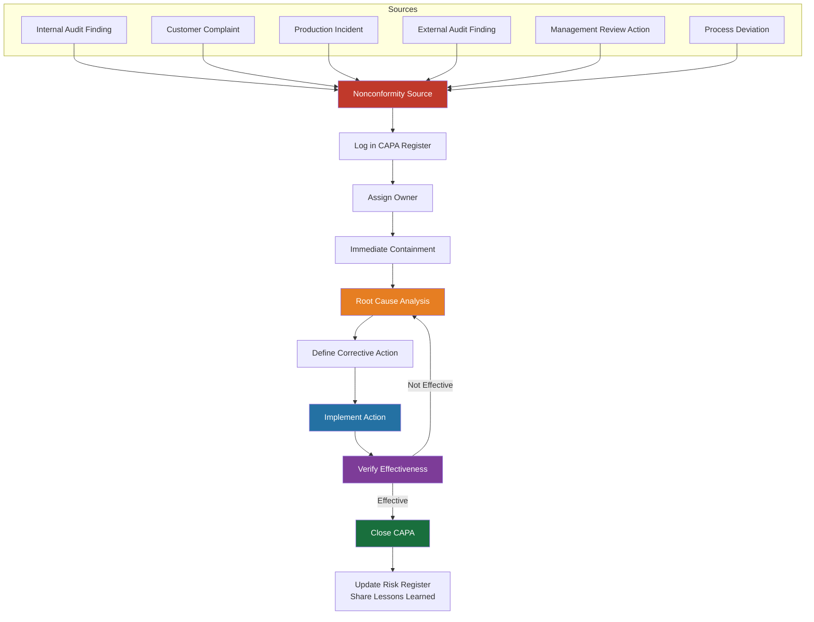

# REF-13: CAPA Log (Corrective and Preventive Action)

## DDD Unit — Data Driven Development | AD/ADAS Tooling

**Document Owner:** QMR
**Last Review:** YYYY-MM-DD
**Review Frequency:** Monthly

---

## 1. Purpose

Tracks all corrective and preventive actions from nonconformities, audit findings, customer complaints, and incidents, as required by ISO 9001:2015 Clause 10.2.

---

## 2. CAPA Process

---

## 3. Root Cause Analysis Methods

| Method | When to Use | Description |
|--------|------------|-------------|
| **5-Why** | Most nonconformities | Ask "Why?" iteratively until root cause is found |
| **Fishbone (Ishikawa)** | Complex issues with multiple potential causes | Categorize causes: People, Process, Technology, Environment |
| **Fault Tree Analysis** | Critical/safety-related issues | Top-down deductive analysis |
| **Timeline Analysis** | Incidents with complex sequence of events | Map events chronologically to find trigger |

---

## 4. CAPA Register

| CAPA # | Date Opened | Source | Description | Severity | Root Cause Method | Root Cause | Containment Action | Corrective Action | Owner | Due Date | Status | Effectiveness Check Date | Effective? | Date Closed |
|:------:|:----------:|:------:|-------------|:--------:|:-----------------:|------------|-------------------|-------------------|-------|:--------:|:------:|:------------------------:|:----------:|:-----------:|
| CA-001 | YYYY-MM-DD | _[Source]_ | _[Description of nonconformity]_ | Critical / Major / Minor | 5-Why | _[Root cause]_ | _[Immediate action taken]_ | _[Corrective action]_ | _[Name]_ | YYYY-MM-DD | ☐ Open | YYYY-MM-DD | ☐ Yes / ☐ No | YYYY-MM-DD |
| CA-002 | | | | | | | | | | | | | | |
| CA-003 | | | | | | | | | | | | | | |

---

## 5. Example CAPA Entry (for reference)

| Field | Example |
|-------|---------|
| **CAPA #** | CA-001 |
| **Date Opened** | 2026-01-15 |
| **Source** | Production Incident INC-2026-042 |
| **Description** | Reprocessing pipeline produced corrupted output for 3 datasets due to race condition in parallel processing |
| **Severity** | Critical |
| **Root Cause Method** | 5-Why |
| **Root Cause** | Shared mutable state in pipeline worker threads without proper locking; insufficient integration test coverage for concurrent scenarios |
| **Containment** | Immediately halted affected pipeline runs; manually re-processed impacted datasets; notified affected AD teams |
| **Corrective Action** | (1) Implemented thread-safe data handling with immutable data structures; (2) Added concurrent integration tests; (3) Added data integrity checksums at pipeline output |
| **Owner** | [Data Engineering Lead] |
| **Due Date** | 2026-02-15 |
| **Status** | ✅ Closed |
| **Effectiveness Check** | 2026-03-15 — No recurrence; all pipeline outputs pass integrity checks |
| **Effective?** | ✅ Yes |
| **Date Closed** | 2026-03-15 |

---

## 6. CAPA Dashboard Metrics

| Metric | Current Period | Previous Period | Trend |
|--------|:-------------:|:--------------:|:-----:|
| Open CAPAs | _[#]_ | _[#]_ | ↑↓→ |
| CAPAs opened this period | _[#]_ | _[#]_ | ↑↓→ |
| CAPAs closed this period | _[#]_ | _[#]_ | ↑↓→ |
| Average time to close | _[days]_ | _[days]_ | ↑↓→ |
| Overdue CAPAs | _[#]_ | _[#]_ | ↑↓→ |
| Effectiveness rate | _[%]_ | _[%]_ | ↑↓→ |
| Recurring issues | _[#]_ | _[#]_ | ↑↓→ |

---

## 7. Lessons Learned Register

| CAPA # | Lesson | Shared With | Date Shared | Applied To |
|:------:|--------|-------------|:-----------:|------------|
| CA-001 | _[Key learning]_ | _[Teams/All-hands]_ | YYYY-MM-DD | _[Process/standard updated]_ |
| | | | | |

---

## 8. Review Log

| Date | Reviewer | Changes Made |
|------|----------|-------------|
| YYYY-MM-DD | [Name] | Initial creation |

---

*ISO 9001:2015 Reference: Clause 10.2*
