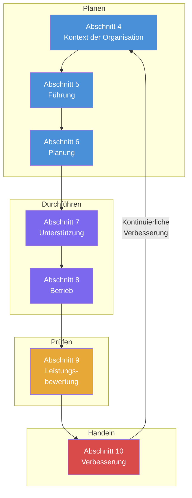

# ISO 9001:2015 Audit-Vorbereitungspaket

**Umfassende Vorbereitungsmaterialien für die ISO 9001:2015 Zertifizierung**

---

## DDD-Abteilung — Data Driven Development | AD/ADAS Tooling

Willkommen zur ISO 9001:2015 Audit-Vorbereitungsdokumentation der Abteilung Data Driven Development (DDD). Wir entwickeln und betreiben Werkzeuge für Datenengineering, Datenspeicherung, Simulation und Reprocessing, die von Softwareentwicklern im Bereich Autonomes Fahren (AD) und Fahrerassistenzsysteme (ADAS) genutzt werden.

---

## Schnellstart

!!! tip "Neu in dieser Dokumentation?"
    Beginnen Sie mit dem [Auditkatalog](getting-started/audit-catalogue.md), um typische Auditorfragen und empfohlene Antworten kennenzulernen.

### Inhalt dieses Pakets

Diese Dokumentation ist so aufgebaut, dass sie Ihre Auditvorbereitung systematisch unterstützt:

---

## Dokumentationsstruktur

### :rocket: Erste Schritte

Wesentliche Dokumente für den Einstieg in Ihre Vorbereitung:

- **[Auditkatalog](getting-started/audit-catalogue.md)** — 70+ typische Auditorfragen mit Antwortvorschlägen, gegliedert nach ISO 9001 Abschnitten
- **[Prozesslandkarte](getting-started/process-map.md)** — Vollständige QMS-Prozesslandschaft mit Diagrammen für Management-, Kern- und Unterstützungsprozesse
- **[Vorbereitungs-Checkliste](getting-started/preparation-checklist.md)** — Phasenbasierter Zeitplan mit Aufgaben, Nachweissammlung und Checkliste für den Audittag

### :material-office-building: QMS-Rahmenwerk (Abschnitte 4-5)

Grundlagendokumente zur Etablierung Ihres Qualitätsmanagementsystems:

- **[Kontextanalyse](qms-framework/context-analysis.md)** — SWOT/PESTLE-Analyse (Abschnitt 4.1)
- **[Stakeholder-Register](qms-framework/stakeholder-register.md)** — Interessierte Parteien und deren Anforderungen (Abschnitt 4.2)
- **[QMS-Geltungsbereich](qms-framework/qms-scope.md)** — Geltungsbereichserklärung mit Begründungen (Abschnitt 4.3)
- **[Qualitätspolitik](qms-framework/quality-policy.md)** — Qualitätspolitik der Abteilung (Abschnitt 5.2)
- **[RACI-Matrix](qms-framework/raci-matrix.md)** — Rollen und Verantwortlichkeiten (Abschnitt 5.3)

### :material-target: Planung (Abschnitt 6)

Strategische Planungsdokumente für Qualität:

- **[Risikoregister](planning/risk-register.md)** — Risiko- und Chancenregister mit Maßnahmenplänen (Abschnitt 6.1)
- **[Qualitätsziele](planning/quality-objectives.md)** — Qualitätsziele und KPIs mit Messkonzepten (Abschnitt 6.2)

### :material-tools: Unterstützung (Abschnitt 7)

Unterstützungsprozesse für die Qualitätssicherung:

- **[Kompetenzmatrix](support/competency-matrix.md)** — Kompetenzmanagement und Schulung (Abschnitt 7.2)
- **[Kommunikationsmatrix](support/communication-matrix.md)** — Interner und externer Kommunikationsplan (Abschnitt 7.4)

### :material-cog: Betrieb (Abschnitt 8)

Betriebliche Prozesse für die Produkt-/Dienstleistungserbringung:

- **[Lieferantenbewertung](operations/supplier-evaluation.md)** — Lieferanten- und Anbietermanagement (Abschnitt 8.4)

### :material-chart-line: Leistungsbewertung (Abschnitt 9)

Überwachung und Messung der QMS-Leistung:

- **[Internes Auditprogramm](performance/internal-audit-program.md)** — Jährlicher Auditplan und Verfahren (Abschnitt 9.2)
- **[Managementbewertung](performance/management-review.md)** — Vorlage und Eingaben für die Managementbewertung (Abschnitt 9.3)

### :material-arrow-up-bold: Verbesserung (Abschnitt 10)

Prozesse zur kontinuierlichen Verbesserung:

- **[CAPA-Protokoll](improvement/capa-log.md)** — Nachverfolgung von Korrektur- und Vorbeugemaßnahmen (Abschnitt 10.2)

---

## Nutzung dieser Dokumentation

### :one: Zur Auditvorbereitung

1. **[Auditkatalog](getting-started/audit-catalogue.md) durcharbeiten** — Machen Sie sich mit typischen Fragen für Ihren Bereich vertraut
2. **Referenzdokumente ausfüllen** — Ersetzen Sie Platzhalter durch Ihre abteilungsspezifischen Informationen
3. **[Vorbereitungs-Checkliste](getting-started/preparation-checklist.md) befolgen** — Verfolgen Sie den Fortschritt anhand des Phasenplans
4. **Nachweise sammeln** — Stellen Sie aktuelle Aufzeichnungen zusammen, die die Prozessdurchführung belegen

### :two: Vor dem Audit

!!! warning "Finale Bereitschaftsprüfung"
    Vervollständigen Sie die Checkliste für den Audittag in der [Vorbereitungs-Checkliste](getting-started/preparation-checklist.md)

- Sicherstellen, dass alle Dokumente geprüft und freigegeben sind
- Nachweisordner übersichtlich organisieren
- Probeinterviews mit Teammitgliedern durchführen
- Team über Audit-Erwartungen informieren

### :three: Während des Audits

!!! info "Gespräch mit Auditoren"
    Verwenden Sie die vorgeschlagenen Antworten als Orientierung — sprechen Sie natürlich, nicht nach Skript. Auditoren möchten sehen, dass:
    
    - ✓ Prozesse existieren und dokumentiert sind
    - ✓ Prozesse konsequent befolgt werden
    - ✓ Ergebnisse gemessen werden
    - ✓ Verbesserungen datenbasiert umgesetzt werden

Halten Sie Referenzdokumente bereit, aber führen Sie mit Ihrer tatsächlichen Praxis. Verweisen Sie auf reale Beispiele und Nachweise.

---

## ISO 9001:2015 Struktur (PDCA-Zyklus)

---

## Kernprinzipien

!!! success "Worauf Auditoren achten"
    - **Nachweise statt Dokumentation** — Zeigen Sie reale Aufzeichnungen Ihrer Arbeit
    - **Konsistenz** — Prozesse werden jedes Mal gleich befolgt
    - **Messung** — Sie verfolgen die Leistung mit aussagekräftigen Kennzahlen
    - **Verbesserung** — Sie nutzen Daten, um Änderungen voranzutreiben
    - **Bewusstsein** — Das Team versteht die Qualitätsziele und seine Rolle

---

## Hilfe benötigt?

- **Qualitätsmanagementbeauftragter (QMB):** _[Name]_ — _[E-Mail]_
- **Internes Auditprogramm:** Siehe [Internes Auditprogramm](performance/internal-audit-program.md)
- **Dokumentenfragen:** Siehe Verfahren zur Dokumentenlenkung

---

## Dokumentationsinformationen

- **Erstellt:** 06.02.2026
- **Zuletzt aktualisiert:** 06.02.2026
- **Version:** 1.0
- **Verantwortlich:** Qualitätsmanagementbeauftragter

---

*Diese Dokumentation wird als lebendige Ressource gepflegt. Alle Dokumente sollten vierteljährlich oder bei wesentlichen Änderungen überprüft und aktualisiert werden.*
