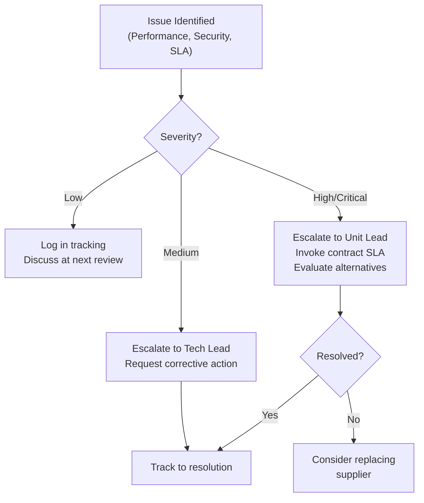

# REF-10: Supplier / Vendor Evaluation

## DDD Unit — Data Driven Development | AD/ADAS Tooling

**Document Owner:** Tech Lead + Procurement
**Last Review:** YYYY-MM-DD
**Next Review:** YYYY-MM-DD

---

## 1. Purpose

Defines the process for evaluating, selecting, and monitoring external providers of products and services, as required by ISO 9001:2015 Clause 8.4.

---

## 2. Supplier Categories

| Category | Examples | Risk Level | Evaluation Depth |
|----------|----------|:----------:|-----------------|
| **A — Strategic** | Cloud providers (AWS, Azure), major SaaS platforms | High | Full evaluation + annual review |
| **B — Important** | Third-party tools, paid libraries, consulting services | Medium | Standard evaluation + periodic review |
| **C — Standard** | Office tools, commodity services, open-source libraries | Low | Simplified assessment |

---

## 3. Evaluation Criteria

### 3.1 Initial Evaluation Scorecard

| Criterion | Weight | Score (1-5) | Weighted Score |
|-----------|:------:|:-----------:|:--------------:|
| **Technical capability** — Meets functional requirements | 25% | _[1-5]_ | |
| **Reliability & availability** — SLA commitments, track record | 20% | _[1-5]_ | |
| **Security posture** — Certifications (ISO 27001, SOC2), vulnerability management | 20% | _[1-5]_ | |
| **Cost effectiveness** — Total cost of ownership | 15% | _[1-5]_ | |
| **Support & responsiveness** — SLA for support, documentation quality | 10% | _[1-5]_ | |
| **Compliance** — License compatibility, regulatory compliance, GDPR | 10% | _[1-5]_ | |
| **Total** | **100%** | | **_[Total]_** |

**Approval thresholds:**
- ≥ 4.0: Approved
- 3.0 – 3.9: Conditionally approved (with documented mitigations)
- < 3.0: Not approved

### 3.2 Additional Criteria for Open-Source Components

| Criterion | Assessment |
|-----------|-----------|
| License compatibility (MIT, Apache 2.0, etc.) | ☐ Compatible |
| Community health (activity, maintainers, issues) | ☐ Active |
| Security vulnerability history | ☐ Acceptable |
| BMW Group InfoSec approval | ☐ Approved |
| SBOM inclusion | ☐ Included |

---

## 4. Approved Supplier Register

| # | Supplier | Category | Product/Service | Evaluation Score | Approval Date | Next Review | Status |
|---|----------|:--------:|-----------------|:----------------:|:-------------:|:-----------:|:------:|
| 1 | AWS | A | Cloud infrastructure | _[Score]_ | YYYY-MM-DD | YYYY-MM-DD | ✅ Approved |
| 2 | _[Vendor]_ | B | _[Service]_ | _[Score]_ | YYYY-MM-DD | YYYY-MM-DD | ✅ Approved |
| 3 | _[Vendor]_ | C | _[Tool]_ | _[Score]_ | YYYY-MM-DD | YYYY-MM-DD | ✅ Approved |
| | _[Add more]_ | | | | | | |

---

## 5. Ongoing Monitoring

### 5.1 Monitoring Methods by Category

| Category | Monitoring Method | Frequency |
|----------|------------------|-----------|
| **A — Strategic** | SLA performance review, service health dashboards, security advisory tracking, annual business review | Monthly metrics, Annual review |
| **B — Important** | SLA compliance check, feature/bug tracking, security advisories | Quarterly |
| **C — Standard** | Dependency vulnerability scanning, license compliance check | Automated (continuous) |

### 5.2 Supplier Performance Tracking

| Supplier | Period | SLA Compliance | Incidents | Security Issues | Support Quality | Overall Rating | Action |
|----------|--------|:--------------:|:---------:|:---------------:|:---------------:|:--------------:|--------|
| _[Name]_ | Q_/YYYY | _[%]_ | _[#]_ | _[#]_ | _[1-5]_ | _[1-5]_ | _[Action if needed]_ |

---

## 6. Supplier Issue Escalation

---

## 7. Review Log

| Date | Reviewer | Changes Made |
|------|----------|-------------|
| YYYY-MM-DD | [Name] | Initial creation |

---

*ISO 9001:2015 Reference: Clause 8.4*
