# REF-11: Internes Auditprogramm

## DDD-Einheit — Data Driven Development | AD/ADAS Tooling

**Dokumentenverantwortlicher:** Qualitätsmanagementbeauftragter (QMB)
**Genehmigt durch:** Abteilungsleiter
**Auditzyklus:** JJJJ
**Nächste Überprüfung:** TT.MM.JJJJ

---

## 1. Zweck

Definiert das interne Auditprogramm zur Überprüfung der QMS-Konformität und -Wirksamkeit, wie von ISO 9001:2015 Abschnitt 9.2 gefordert.

---

## 2. Auditprogramm — Übersicht

### 2.1 Ziele

- Überprüfung der Konformität mit den Anforderungen der ISO 9001:2015
- Überprüfung der Konformität mit den eigenen QMS-Anforderungen der Organisation
- Bewertung der Wirksamkeit des QMS bei der Erreichung von Qualitätszielen
- Identifikation von Verbesserungsmöglichkeiten

### 2.2 Geltungsbereich

Alle Prozesse innerhalb des QMS-Geltungsbereichs der DDD-Einheit (siehe REF-03).

### 2.3 Auditzyklus

Vollständige QMS-Abdeckung über einen **12-Monats-Zyklus**, wobei Bereiche mit hohem Risiko häufiger auditiert werden.

---

## 3. Jährlicher Auditplan

| Audit-Nr. | Monat | ISO 9001 Abschnitte | Auditierte Prozesse | Leitender Auditor | Status |
|:-------:|:-----:|:-----------------:|-------------------|:------------:|:------:|
| A-01 | _[Monat]_ | 4.1, 4.2, 4.3, 4.4 | Kontext, Geltungsbereich, Prozesslandschaft | _[Name]_ | ☐ Geplant |
| A-02 | _[Monat]_ | 5.1, 5.2, 5.3 | Führung, Politik, Rollen | _[Name]_ | ☐ Geplant |
| A-03 | _[Monat]_ | 6.1, 6.2, 6.3 | Risikomanagement, Qualitätsziele, Änderungsplanung | _[Name]_ | ☐ Geplant |
| A-04 | _[Monat]_ | 7.1, 7.2, 7.3, 7.4 | Ressourcen, Kompetenz, Bewusstsein, Kommunikation | _[Name]_ | ☐ Geplant |
| A-05 | _[Monat]_ | 7.5 | Dokumentenlenkung | _[Name]_ | ☐ Geplant |
| A-06 | _[Monat]_ | 8.1, 8.2, 8.3 | Betriebliche Planung, Anforderungen, Design & Entwicklung | _[Name]_ | ☐ Geplant |
| A-07 | _[Monat]_ | 8.4, 8.5, 8.7 | Lieferanten, Dienstleistungserbringung, fehlerhafte Ergebnisse | _[Name]_ | ☐ Geplant |
| A-08 | _[Monat]_ | 9.1, 9.2, 9.3 | Überwachung, internes Audit, Managementbewertung | _[Name]_ | ☐ Geplant |
| A-09 | _[Monat]_ | 10.1, 10.2, 10.3 | Verbesserung, CAPA, fortlaufende Verbesserung | _[Name]_ | ☐ Geplant |

---

## 4. Auditorenqualifikation

### 4.1 Anforderungen

| Kriterium | Anforderung |
|-----------|------------|
| Schulung | ISO 9001 Interne-Auditoren-Schulung (mind. 16 Stunden) |
| Unabhängigkeit | Darf nicht die eigene Arbeit oder den eigenen Verantwortungsbereich auditieren |
| Fachwissen | Verständnis des zu auditierenden Prozesses |
| Erfahrung | Mindestens 1 Audit als Beobachter vor der Leitung |

### 4.2 Registrierte interne Auditoren

| Name | Schulungsdatum | Zertifizierung | Qualifizierte Auditbereiche | Aktiv |
|------|:------------:|:-------------:|--------------------------|:------:|
| _[Name]_ | TT.MM.JJJJ | _[Zert.-Nr.]_ | Alle Abschnitte | ✅ |
| _[Name]_ | TT.MM.JJJJ | _[Zert.-Nr.]_ | Abschnitte 7, 8 | ✅ |
| _[Name]_ | TT.MM.JJJJ | _[Zert.-Nr.]_ | Abschnitte 8, 9 | ✅ |

---

## 5. Auditprozess

```mermaid
graph LR
    A["Jahresplan<br/>(Risikobasiert)"] --> B["Vorbereitung<br/>(Checkliste,<br/>Terminplanung)"]
    B --> C["Eröffnungs-<br/>besprechung"]
    C --> D["Audit durchführen<br/>(Interviews,<br/>Nachweispr.)"]
    D --> E["Abschluss-<br/>besprechung"]
    E --> F["Auditbericht<br/>(Feststellungen,<br/>Beobachtungen)"]
    F --> G["Korrektur-<br/>maßnahmen<br/>(bei Festst.)"]
    G --> H["Nachverfolgung &<br/>Wirksamkeits-<br/>prüfung"]
    H --> I["Bericht an<br/>Management-<br/>bewertung"]
    style A fill:#1a5276,color:#fff
    style D fill:#196f3d,color:#fff
    style F fill:#e67e22,color:#fff
    style G fill:#c0392b,color:#fff
    style I fill:#7d3c98,color:#fff
```

### 5.1 Schritte der Auditdurchführung

1. **Vorbereitung (1 Woche vorher)**
   - Vorherige Auditergebnisse überprüfen
   - Audit-Checkliste auf Basis der Abschnitte und Prozesse erstellen
   - Auditierte über Zeitplan, Umfang und erforderliche Nachweise informieren

2. **Eröffnungsbesprechung (15 Min.)**
   - Umfang, Zeitplan und Methodik bestätigen
   - Klassifizierung der Feststellungen erklären

3. **Auditdurchführung (1-2 Tage pro Audit)**
   - Prozessverantwortliche und Anwender befragen
   - Dokumentierte Informationen überprüfen (Verfahren, Aufzeichnungen)
   - Tatsächliche Praktiken beobachten
   - Objektive Nachweise prüfen

4. **Abschlussbesprechung (30 Min.)**
   - Vorläufige Feststellungen präsentieren
   - Klassifizierung der Feststellungen vereinbaren
   - Zeitrahmen für Korrekturmaßnahmen besprechen

5. **Auditbericht (innerhalb von 5 Arbeitstagen)**
   - Feststellungen, Beobachtungen und positive Praktiken dokumentieren
   - Feststellungen klassifizieren (Schwere NK / Leichte NK / Beobachtung / Verbesserungsmöglichkeit)

6. **Nachverfolgung (gemäß vereinbartem Zeitrahmen)**
   - Auditierter reicht Korrekturmaßnahmenplan ein
   - Auditor überprüft Umsetzung und Wirksamkeit

---

## 6. Klassifizierung der Feststellungen

| Klassifizierung | Beschreibung | Erforderliche Reaktion |
|---------------|-------------|-------------------|
| **Schwere Nichtkonformität** | Fehlen oder vollständiger Zusammenbruch eines erforderlichen Prozesses oder systematisches Versagen | CAPA innerhalb von 30 Tagen, Grundursachenanalyse erforderlich |
| **Leichte Nichtkonformität** | Einzelner Verstoß oder teilweise Nichterfüllung einer Anforderung | CAPA innerhalb von 60 Tagen |
| **Beobachtung** | Keine Nichtkonformität, aber ein potenzielles Risiko oder ein problematischer Bereich | Empfohlene Maßnahme, wird verfolgt |
| **Verbesserungsmöglichkeit** | Positiver Vorschlag zur Verbesserung | Optional, wird verfolgt |
| **Positive Praxis** | Bemerkenswerte gute Praxis | Als Best Practice geteilt |

---

## 7. Feststellungsprotokoll

| Audit-Nr. | Festst.-Nr. | Klassifizierung | Beschreibung | Grundursache | Korrekturmaßnahme | Verantwortlich | Fälligkeitsdatum | Status | Wirksamkeit überprüft |
|:-------:|:---------:|:--------------:|-------------|------------|-------------------|-------|:--------:|:------:|:---------------------:|
| A-01 | F-001 | _[Typ]_ | _[Beschreibung]_ | _[Grundursache]_ | _[Maßnahme]_ | _[Name]_ | _[Datum]_ | ☐ Offen | ☐ |
| | | | | | | | | | |

---

## 8. Überprüfungsprotokoll

| Datum | Prüfer | Vorgenommene Änderungen |
|------|----------|-------------|
| TT.MM.JJJJ | [Name] | Erstmalige Erstellung |

---

*ISO 9001:2015 Referenz: Abschnitt 9.2*
