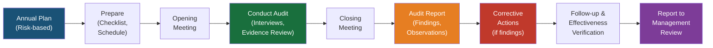

# REF-11: Internal Audit Program

## DDD Unit — Data Driven Development | AD/ADAS Tooling

**Document Owner:** QMR
**Approved by:** Unit Lead
**Audit Cycle:** YYYY
**Next Review:** YYYY-MM-DD

---

## 1. Purpose

Defines the internal audit program to verify QMS conformance and effectiveness, as required by ISO 9001:2015 Clause 9.2.

---

## 2. Audit Program Overview

### 2.1 Objectives

- Verify conformance to ISO 9001:2015 requirements
- Verify conformance to the organization's own QMS requirements
- Assess effectiveness of the QMS in achieving quality objectives
- Identify opportunities for improvement

### 2.2 Scope

All processes within the DDD unit's QMS scope (see REF-03).

### 2.3 Audit Cycle

Full QMS coverage over a **12-month cycle**, with high-risk areas audited more frequently.

---

## 3. Annual Audit Schedule

| Audit # | Month | ISO 9001 Clauses | Processes Audited | Lead Auditor | Status |
|:-------:|:-----:|:-----------------:|-------------------|:------------:|:------:|
| A-01 | _[Month]_ | 4.1, 4.2, 4.3, 4.4 | Context, scope, process landscape | _[Name]_ | ☐ Planned |
| A-02 | _[Month]_ | 5.1, 5.2, 5.3 | Leadership, policy, roles | _[Name]_ | ☐ Planned |
| A-03 | _[Month]_ | 6.1, 6.2, 6.3 | Risk management, quality objectives, change planning | _[Name]_ | ☐ Planned |
| A-04 | _[Month]_ | 7.1, 7.2, 7.3, 7.4 | Resources, competence, awareness, communication | _[Name]_ | ☐ Planned |
| A-05 | _[Month]_ | 7.5 | Document control | _[Name]_ | ☐ Planned |
| A-06 | _[Month]_ | 8.1, 8.2, 8.3 | Operational planning, requirements, design & development | _[Name]_ | ☐ Planned |
| A-07 | _[Month]_ | 8.4, 8.5, 8.7 | Suppliers, service provision, nonconforming outputs | _[Name]_ | ☐ Planned |
| A-08 | _[Month]_ | 9.1, 9.2, 9.3 | Monitoring, internal audit, management review | _[Name]_ | ☐ Planned |
| A-09 | _[Month]_ | 10.1, 10.2, 10.3 | Improvement, CAPA, continual improvement | _[Name]_ | ☐ Planned |

---

## 4. Auditor Qualification

### 4.1 Requirements

| Criterion | Requirement |
|-----------|------------|
| Training | ISO 9001 internal auditor training (min. 16 hours) |
| Independence | Must not audit their own work or area of responsibility |
| Knowledge | Understanding of the process being audited |
| Experience | Minimum 1 audit as observer before leading |

### 4.2 Registered Internal Auditors

| Name | Training Date | Certification | Areas Qualified to Audit | Active |
|------|:------------:|:-------------:|--------------------------|:------:|
| _[Name]_ | YYYY-MM-DD | _[Cert #]_ | All clauses | ✅ |
| _[Name]_ | YYYY-MM-DD | _[Cert #]_ | Clauses 7, 8 | ✅ |
| _[Name]_ | YYYY-MM-DD | _[Cert #]_ | Clauses 8, 9 | ✅ |

---

## 5. Audit Process

### 5.1 Audit Execution Steps

1. **Preparation (1 week before)**
   - Review previous audit results
   - Prepare audit checklist based on clauses and processes
   - Notify auditees of schedule, scope, and required evidence

2. **Opening Meeting (15 min)**
   - Confirm scope, schedule, and methodology
   - Explain finding classification

3. **Audit Execution (1-2 days per audit)**
   - Interview process owners and practitioners
   - Review documented information (procedures, records)
   - Observe actual practices
   - Check objective evidence

4. **Closing Meeting (30 min)**
   - Present preliminary findings
   - Agree on finding classification
   - Discuss corrective action timeline

5. **Audit Report (within 5 working days)**
   - Document findings, observations, and positive practices
   - Classify findings (Major NC / Minor NC / Observation / Opportunity)

6. **Follow-up (per agreed timeline)**
   - Auditee submits corrective action plan
   - Auditor verifies implementation and effectiveness

---

## 6. Finding Classification

| Classification | Description | Response Required |
|---------------|-------------|-------------------|
| **Major Nonconformity** | Absence or total breakdown of a required process or systematic failure | CAPA within 30 days, root cause analysis required |
| **Minor Nonconformity** | Isolated lapse or partial non-fulfillment of a requirement | CAPA within 60 days |
| **Observation** | Not a nonconformity but a potential risk or area of concern | Recommended action, tracked |
| **Opportunity for Improvement** | Positive suggestion for enhancement | Optional, tracked |
| **Positive Practice** | Noteworthy good practice | Shared as best practice |

---

## 7. Audit Finding Log

| Audit # | Finding # | Classification | Description | Root Cause | Corrective Action | Owner | Due Date | Status | Effectiveness Verified |
|:-------:|:---------:|:--------------:|-------------|------------|-------------------|-------|:--------:|:------:|:---------------------:|
| A-01 | F-001 | _[Type]_ | _[Description]_ | _[Root cause]_ | _[Action]_ | _[Name]_ | _[Date]_ | ☐ Open | ☐ |
| | | | | | | | | | |

---

## 8. Review Log

| Date | Reviewer | Changes Made |
|------|----------|-------------|
| YYYY-MM-DD | [Name] | Initial creation |

---

*ISO 9001:2015 Reference: Clause 9.2*
