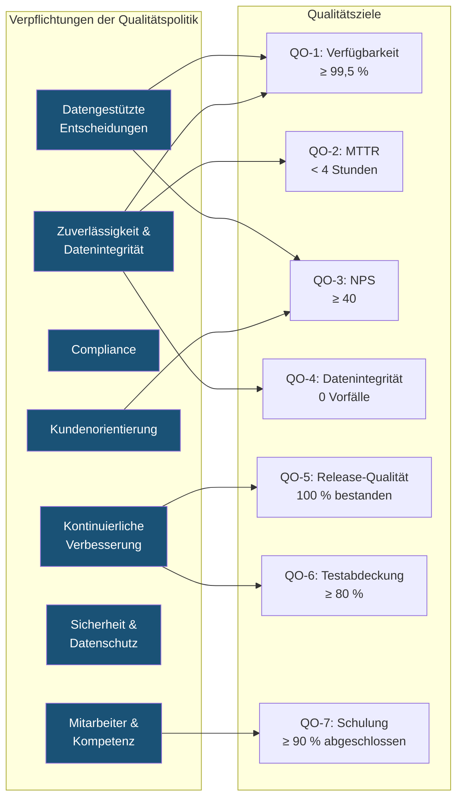

# REF-07: Qualitätsziele

## DDD Unit — Data Driven Development | AD/ADAS Tooling

**Dokumentenverantwortlicher:** QMR
**Genehmigt durch:** Unit Lead
**Gültigkeitszeitraum:** JJJJ Q1 – JJJJ Q4
**Überprüfungshäufigkeit:** Vierteljährlich

---

## 1. Übersicht der Qualitätsziele

Qualitätsziele werden aus unserer Qualitätspolitik abgeleitet und mit unseren OKRs abgestimmt. Jedes Ziel ist SMART (Spezifisch, Messbar, Erreichbar, Relevant, Terminiert).

---

## 2. Qualitätsziele

### QO-1: Werkzeugverfügbarkeit & Zuverlässigkeit

| Attribut | Detail |
|----------|--------|
| **Ziel** | Hohe Verfügbarkeit aller Produktionswerkzeuge und -dienste sicherstellen |
| **Politikbezug** | „Zuverlässigkeit & Datenintegrität" |
| **KPI** | Dienstverfügbarkeit (Betriebszeit) |
| **Zielwert** | ≥ 99,5 % pro Quartal |
| **Messung** | Automatisiertes Monitoring (Prometheus/Grafana), monatliche SLA-Berichte |
| **Häufigkeit** | Kontinuierlich überwacht, monatlich berichtet |
| **Verantwortlicher** | DevOps/SRE Lead |
| **Aktueller Status** | _[Ausfüllen: z. B. Q4 2025 = 99,7 %]_ |

### QO-2: Reaktionszeit bei Vorfällen

| Attribut | Detail |
|----------|--------|
| **Ziel** | Kritische Produktionsprobleme schnell beheben |
| **Politikbezug** | „Zuverlässigkeit & Datenintegrität" |
| **KPI** | Mittlere Wiederherstellungszeit (MTTR) für kritische/P1-Vorfälle |
| **Zielwert** | < 4 Stunden |
| **Messung** | Jira/PagerDuty Vorfallverfolgung |
| **Häufigkeit** | Pro Vorfall, monatlich aggregiert |
| **Verantwortlicher** | Team Lead / Bereitschaftsingenieur |
| **Aktueller Status** | _[Ausfüllen]_ |

### QO-3: Kundenzufriedenheit

| Attribut | Detail |
|----------|--------|
| **Ziel** | Hohe Kundenzufriedenheit erreichen und aufrechterhalten |
| **Politikbezug** | „Kundenorientierung" |
| **KPI** | Net Promoter Score (NPS) |
| **Zielwert** | ≥ 40 |
| **Messung** | Vierteljährliche NPS-Umfrage bei AD/ADAS-Teams |
| **Häufigkeit** | Vierteljährlich |
| **Verantwortlicher** | Product Owner |
| **Aktueller Status** | _[Ausfüllen]_ |

### QO-4: Datenintegrität

| Attribut | Detail |
|----------|--------|
| **Ziel** | Null Datenintegritätsvorfälle in Produktions-Pipelines sicherstellen |
| **Politikbezug** | „Zuverlässigkeit & Datenintegrität" |
| **KPI** | Anzahl der Datenintegritätsvorfälle |
| **Zielwert** | 0 pro Quartal |
| **Messung** | Vorfallverfolgung, Datenvalidierungsprüfungen |
| **Häufigkeit** | Kontinuierlich überwacht, vierteljährlich berichtet |
| **Verantwortlicher** | Data Engineering Lead |
| **Aktueller Status** | _[Ausfüllen]_ |

### QO-5: Release-Qualität

| Attribut | Detail |
|----------|--------|
| **Ziel** | Alle Produktions-Releases bestehen automatisierte Qualitäts-Gates |
| **Politikbezug** | „Kontinuierliche Verbesserung" |
| **KPI** | Release-Bestehensrate durch CI/CD-Qualitäts-Gates |
| **Zielwert** | 100 % der Releases bestehen die automatisierte Regressionssuite vor Produktivstellung |
| **Messung** | CI/CD-Pipeline-Metriken |
| **Häufigkeit** | Pro Release, monatlich aggregiert |
| **Verantwortlicher** | DevOps Lead |
| **Aktueller Status** | _[Ausfüllen]_ |

### QO-6: Testabdeckung

| Attribut | Detail |
|----------|--------|
| **Ziel** | Umfassende automatisierte Testabdeckung aufrechterhalten |
| **Politikbezug** | „Kontinuierliche Verbesserung" |
| **KPI** | Code-Abdeckungsgrad |
| **Zielwert** | ≥ 80 % über alle Produktionsdienste |
| **Messung** | Abdeckungswerkzeuge (Istanbul, pytest-cov) |
| **Häufigkeit** | Pro PR, monatlich aggregiert |
| **Verantwortlicher** | Team Leads |
| **Aktueller Status** | _[Ausfüllen]_ |

### QO-7: Kompetenzentwicklung

| Attribut | Detail |
|----------|--------|
| **Ziel** | Teamkompetenz durch strukturierte Entwicklung sicherstellen |
| **Politikbezug** | „Mitarbeiter & Kompetenz" |
| **KPI** | Abschlussrate des Schulungsplans |
| **Zielwert** | ≥ 90 % der geplanten Schulungen pro Jahr abgeschlossen |
| **Messung** | HR-System / Schulungsprotokoll |
| **Häufigkeit** | Jährlich |
| **Verantwortlicher** | Team Leads + HR |
| **Aktueller Status** | _[Ausfüllen]_ |

---

## 3. Rückverfolgbarkeit: Politik → Ziele → KPIs

---

## 4. Vierteljährliche Überprüfungsverfolgung

| Ziel | Q1 Ist | Q2 Ist | Q3 Ist | Q4 Ist | Trend |
|------|--------|--------|--------|--------|-------|
| QO-1: Verfügbarkeit | _[Ausfüllen]_ | | | | |
| QO-2: MTTR | _[Ausfüllen]_ | | | | |
| QO-3: NPS | _[Ausfüllen]_ | | | | |
| QO-4: Datenintegrität | _[Ausfüllen]_ | | | | |
| QO-5: Release-Qualität | _[Ausfüllen]_ | | | | |
| QO-6: Testabdeckung | _[Ausfüllen]_ | | | | |
| QO-7: Schulung | _[Ausfüllen]_ | | | | |

---

## 5. Überprüfungsprotokoll

| Datum | Prüfer | Vorgenommene Änderungen |
|-------|--------|------------------------|
| TT.MM.JJJJ | [Name] | Erstmalige Erstellung |

---

*ISO 9001:2015 Referenz: Abschnitt 6.2*
