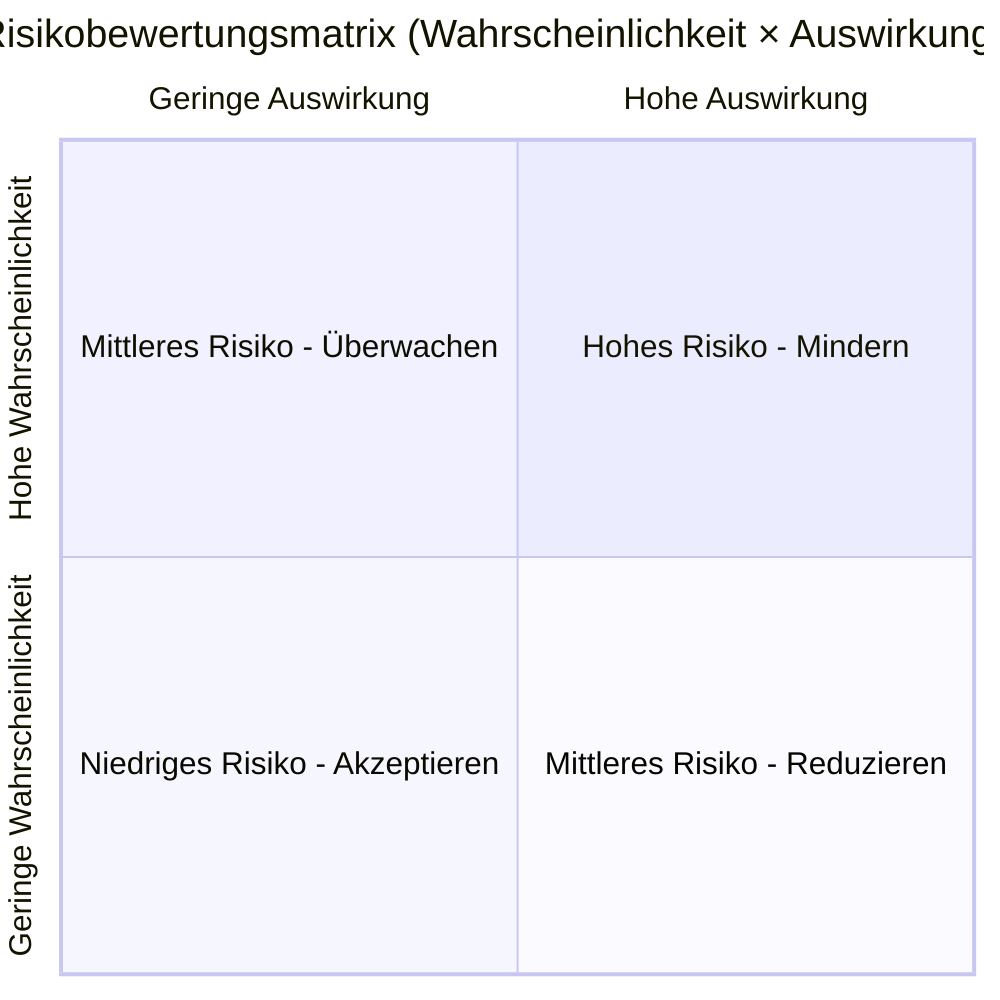

# REF-06: Risikoregister

## DDD Unit — Data Driven Development | AD/ADAS Tooling

**Dokumentenverantwortlicher:** QMR
**Letzte Überprüfung:** TT.MM.JJJJ
**Nächste Überprüfung:** TT.MM.JJJJ
**Überprüfungshäufigkeit:** Vierteljährlich

---

## 1. Risikobewertungsmethodik

### 1.1 Wahrscheinlichkeitsskala

| Bewertung | Stufe | Beschreibung |
|-----------|-------|--------------|
| 1 | Selten | < 5 % Wahrscheinlichkeit in den nächsten 12 Monaten |
| 2 | Unwahrscheinlich | 5–20 % Wahrscheinlichkeit |
| 3 | Möglich | 20–50 % Wahrscheinlichkeit |
| 4 | Wahrscheinlich | 50–80 % Wahrscheinlichkeit |
| 5 | Fast sicher | > 80 % Wahrscheinlichkeit |

### 1.2 Auswirkungsskala

| Bewertung | Stufe | Beschreibung |
|-----------|-------|--------------|
| 1 | Vernachlässigbar | Geringfügige Unannehmlichkeit, keine SLA-Auswirkung |
| 2 | Gering | Reduzierte Leistung, Workaround verfügbar |
| 3 | Mäßig | SLA-Verletzung für einige Nutzer, erheblicher Aufwand zur Behebung |
| 4 | Schwerwiegend | Größerer Dienstausfall, Bedenken hinsichtlich Datenintegrität, Kundeneskalation |
| 5 | Kritisch | Vollständiger Dienstausfall, Datenverlust, sicherheitsrelevante Auswirkung, Verstoß gegen Vorschriften |

### 1.3 Risikomatrix

| Risikobewertung | Stufe | Erforderliche Maßnahme |
|-----------------|-------|------------------------|
| 1–4 | **Niedrig** (Grün) | Akzeptieren und überwachen |
| 5–9 | **Mittel** (Gelb) | Reduzieren — Minderungsmaßnahmen definieren |
| 10–15 | **Hoch** (Orange) | Mindern — aktive Minderung erforderlich |
| 16–25 | **Kritisch** (Rot) | Sofortmaßnahme — an die Leitung eskalieren |

---

## 2. Risikoregister

| ID | Risikobeschreibung | Kategorie | Wahrscheinlichkeit (1-5) | Auswirkung (1-5) | Risikobewertung | Risikostufe | Verantwortlicher | Minderungsmaßnahmen | Status | Zieldatum | Restrisiko |
|----|---------------------|-----------|:------------------------:|:-----------------:|:---------------:|:-----------:|-------------------|---------------------|--------|-----------|:----------:|
| R-001 | Single Point of Failure in der Datenaufnahme-Pipeline | Technisch | 3 | 5 | 15 | Hoch | [Name] | Redundante Aufnahmepfade implementieren, automatisiertes Failover | In Bearbeitung | TT.MM.JJJJ | 6 |
| R-002 | Schlüsselpersonenabhängigkeit für Simulationsinfrastruktur | Personal | 4 | 4 | 16 | Kritisch | [Name] | Cross-Training-Programm, umfassende Runbooks, Paar-Rotationen | In Bearbeitung | TT.MM.JJJJ | 8 |
| R-003 | Cloud-Kostenüberschreitung mit Auswirkung auf das Budget | Finanziell | 3 | 3 | 9 | Mittel | [Name] | FinOps-Praktiken, Kostenwarnungen, reservierte Instanzen | Überwachung | TT.MM.JJJJ | 4 |
| R-004 | Datenschutzverletzung im Fahrdatenspeicher | Sicherheit | 2 | 5 | 10 | Hoch | [Name] | Verschlüsselung im Ruhezustand/bei Übertragung, RBAC, Penetrationstests, Sicherheitsaudits | In Bearbeitung | TT.MM.JJJJ | 5 |
| R-005 | Regulatorische Änderung, die eine Werkzeug-Requalifizierung erfordert | Compliance | 3 | 4 | 12 | Hoch | [Name] | Regulatorisches Monitoring, modularer Qualifizierungsansatz, Einbindung von Rechtsberatung | Überwachung | TT.MM.JJJJ | 8 |
| R-006 | Lieferketten-Schwachstelle in Open-Source-Abhängigkeiten | Technisch | 3 | 4 | 12 | Hoch | [Name] | Abhängigkeitsscanning (Snyk), SBOM-Generierung, genehmigte Abhängigkeitsliste | In Bearbeitung | TT.MM.JJJJ | 6 |
| R-007 | Verlust der Cloud-Provider-Verfügbarkeit (Regionsausfall) | Infrastruktur | 2 | 5 | 10 | Hoch | [Name] | Multi-AZ-Bereitstellung, Disaster-Recovery-Plan, regelmäßige DR-Tests | Umgesetzt | TT.MM.JJJJ | 4 |
| R-008 | Talentabwanderung im wettbewerbsintensiven AD-Markt | Personal | 4 | 3 | 12 | Hoch | [Name] | Wettbewerbsfähige Vergütung, Weiterbildungsbudget, interessante Projekte, Teamkultur | Laufend | TT.MM.JJJJ | 8 |
| R-009 | *[Eigene Risiken hinzufügen]* | | | | | | | | | | |

---

## 3. Chancenregister

| ID | Chance | Kategorie | Wahrscheinlichkeit | Nutzen | Bewertung | Verantwortlicher | Maßnahmen | Status |
|----|--------|-----------|:-------------------:|:------:|:---------:|-------------------|-----------|--------|
| O-001 | Nutzung neuer GPU-Instanzen zur Beschleunigung der Simulation | Technisch | 4 | 4 | 16 | [Name] | PoC mit neuen Instanztypen, Benchmark-Vergleich | In Bewertung |
| O-002 | Simulation-as-a-Service für Partner-OEMs anbieten | Geschäftlich | 2 | 5 | 10 | [Name] | Marktanalyse, Managementvorschlag | Vorgeschlagen |
| O-003 | Einführung von Open-Source-Frameworks zur Reduzierung des Wartungsaufwands | Technisch | 3 | 3 | 9 | [Name] | Evaluierung von OpenAD Kit, ROS2-Tooling | In Bewertung |
| O-004 | *[Eigene Chancen hinzufügen]* | | | | | | | |

---

## 4. Überprüfungsprotokoll

| Datum | Prüfer | Hinzugefügte/geänderte Risiken | Ergebnis |
|-------|--------|--------------------------------|----------|
| TT.MM.JJJJ | [Name] | Erstmalige Erstellung | Ausgangsbasis festgelegt |
| | | | |

---

*ISO 9001:2015 Referenz: Abschnitt 6.1*
