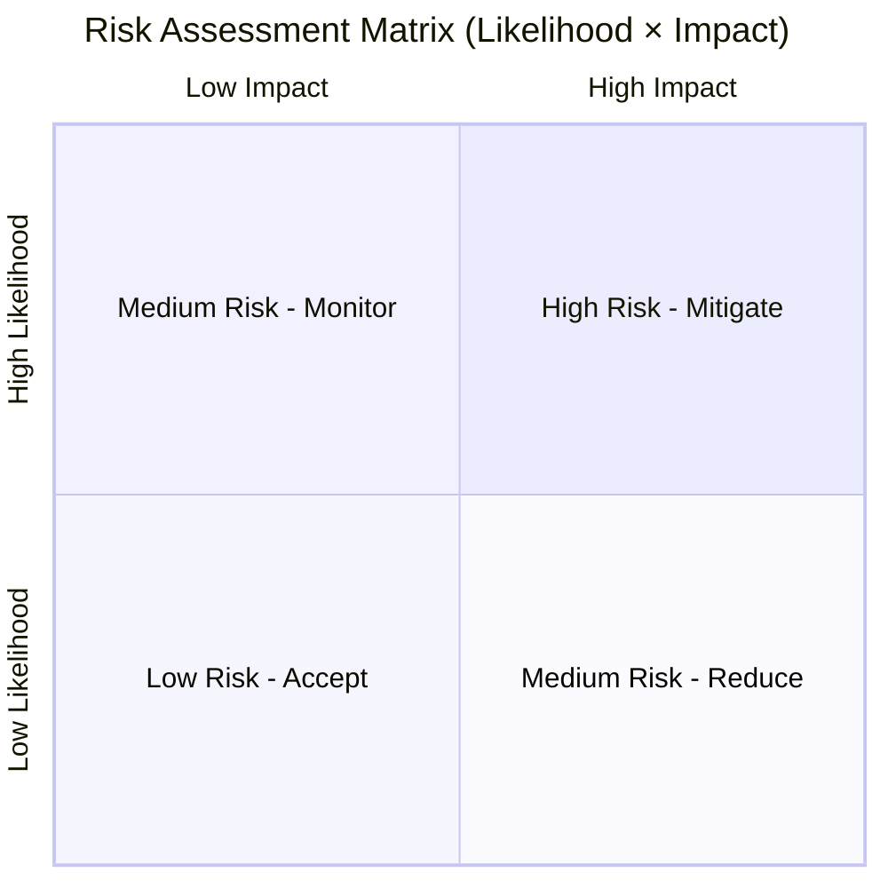

# REF-06: Risk Register

## DDD Unit — Data Driven Development | AD/ADAS Tooling

**Document Owner:** QMR
**Last Review:** YYYY-MM-DD
**Next Review:** YYYY-MM-DD
**Review Frequency:** Quarterly

---

## 1. Risk Assessment Methodology

### 1.1 Likelihood Scale

| Score | Level | Description |
|-------|-------|-------------|
| 1 | Rare | < 5% probability in next 12 months |
| 2 | Unlikely | 5–20% probability |
| 3 | Possible | 20–50% probability |
| 4 | Likely | 50–80% probability |
| 5 | Almost Certain | > 80% probability |

### 1.2 Impact Scale

| Score | Level | Description |
|-------|-------|-------------|
| 1 | Negligible | Minor inconvenience, no SLA impact |
| 2 | Minor | Reduced performance, workaround available |
| 3 | Moderate | SLA breach for some users, significant effort to resolve |
| 4 | Major | Major service outage, data integrity concern, customer escalation |
| 5 | Critical | Complete service failure, data loss, safety-relevant impact, regulatory breach |

### 1.3 Risk Matrix

| Risk Score | Level | Action Required |
|------------|-------|-----------------|
| 1–4 | **Low** (Green) | Accept and monitor |
| 5–9 | **Medium** (Yellow) | Reduce — define mitigation actions |
| 10–15 | **High** (Orange) | Mitigate — active mitigation required |
| 16–25 | **Critical** (Red) | Immediate action — escalate to management |

---

## 2. Risk Register

| ID | Risk Description | Category | Likelihood (1-5) | Impact (1-5) | Risk Score | Risk Level | Owner | Mitigation Actions | Status | Target Date | Residual Risk |
|----|-----------------|----------|:-----------------:|:------------:|:----------:|:----------:|-------|-------------------|--------|-------------|:-------------:|
| R-001 | Single point of failure in data ingestion pipeline | Technical | 3 | 5 | 15 | High | [Name] | Implement redundant ingestion paths, automated failover | In Progress | YYYY-MM-DD | 6 |
| R-002 | Key person dependency for simulation infrastructure | People | 4 | 4 | 16 | Critical | [Name] | Cross-training program, comprehensive runbooks, pair rotations | In Progress | YYYY-MM-DD | 8 |
| R-003 | Cloud cost overrun impacting budget | Financial | 3 | 3 | 9 | Medium | [Name] | FinOps practices, cost alerts, reserved instances | Monitoring | YYYY-MM-DD | 4 |
| R-004 | Data breach in driving data storage | Security | 2 | 5 | 10 | High | [Name] | Encryption at rest/transit, RBAC, penetration testing, security audits | In Progress | YYYY-MM-DD | 5 |
| R-005 | Regulatory change requiring tool re-qualification | Compliance | 3 | 4 | 12 | High | [Name] | Regulatory monitoring, modular qualification approach, legal counsel engagement | Monitoring | YYYY-MM-DD | 8 |
| R-006 | Supply chain vulnerability in open-source dependencies | Technical | 3 | 4 | 12 | High | [Name] | Dependency scanning (Snyk), SBOM generation, approved dependency list | In Progress | YYYY-MM-DD | 6 |
| R-007 | Loss of cloud provider availability (region outage) | Infrastructure | 2 | 5 | 10 | High | [Name] | Multi-AZ deployment, disaster recovery plan, regular DR testing | Implemented | YYYY-MM-DD | 4 |
| R-008 | Talent attrition in competitive AD market | People | 4 | 3 | 12 | High | [Name] | Competitive compensation, learning budget, interesting projects, team culture | Ongoing | YYYY-MM-DD | 8 |
| R-009 | *[Add your risks]* | | | | | | | | | | |

---

## 3. Opportunity Register

| ID | Opportunity | Category | Likelihood | Benefit | Score | Owner | Actions | Status |
|----|------------|----------|:----------:|:-------:|:-----:|-------|---------|--------|
| O-001 | Leverage new GPU instances for simulation speedup | Technical | 4 | 4 | 16 | [Name] | PoC with new instance types, benchmark comparison | Evaluating |
| O-002 | Offer simulation-as-a-service to partner OEMs | Business | 2 | 5 | 10 | [Name] | Market analysis, management proposal | Proposed |
| O-003 | Adopt open-source frameworks to reduce maintenance | Technical | 3 | 3 | 9 | [Name] | Evaluate OpenAD Kit, ROS2 tooling | Evaluating |
| O-004 | *[Add your opportunities]* | | | | | | | |

---

## 4. Review Log

| Date | Reviewer | Risks Added/Changed | Outcome |
|------|----------|-------------------|---------|
| YYYY-MM-DD | [Name] | Initial creation | Baseline established |
| | | | |

---

*ISO 9001:2015 Reference: Clause 6.1*
