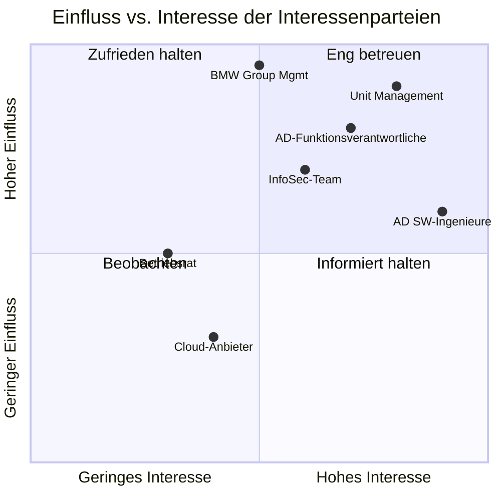

# REF-02: Interessenpartei-Register

## DDD Unit — Data Driven Development | AD/ADAS Tooling

**Dokumentenverantwortlicher:** Product Owner / QMB
**Letzte Überprüfung:** TT.MM.JJJJ
**Nächste Überprüfung:** TT.MM.JJJJ

---

## 1. Zweck

Identifiziert alle relevanten interessierten Parteien, deren Bedürfnisse und Erwartungen sowie unseren Umgang damit, wie von ISO 9001:2015 Abschnitt 4.2 gefordert.

---

## 2. Interessenpartei-Register

| # | Interessenpartei | Kategorie | Bedürfnisse & Erwartungen | Unser Umgang damit | Überwachungsmethode | Priorität |
|---|------------------|-----------|---------------------------|---------------------|---------------------|-----------|
| 1 | **AD/ADAS SW-Ingenieure** | Primärkunde | Zuverlässige, schnelle, gut dokumentierte Tools; reibungsloses Onboarding; reaktionsschneller Support | SLAs, Benutzerdokumentation, Support-Kanäle, regelmäßige Feedback-Sitzungen | NPS-Umfragen, Support-Tickets, Sprint Reviews | Hoch |
| 2 | **AD-Funktionsverantwortliche** | Interner Kunde | Tools, die eine konforme Validierung ermöglichen (ISO 26262, ASPICE) | Nachweise zur Tool-Qualifizierung, Compliance-Dokumentation | Vierteljährliche Abstimmungsmeetings | Hoch |
| 3 | **Unit Management** | Management | Effiziente Ressourcennutzung, strategische Ausrichtung, Qualitätslieferung | OKRs, Management Reviews, KPI-Dashboards | Monatliches Reporting, Management Review | Hoch |
| 4 | **BMW Group Management** | Top-Management | Beitrag zum Erfolg des AD-Programms, Kosteneffizienz | Strategische Roadmap-Abstimmung, Budgetberichterstattung | Vierteljährlicher Geschäftsbericht | Hoch |
| 5 | **Informationssicherheits-Team** | Interner Regulierer | Einhaltung der InfoSec-Richtlinien, sichere Datenverarbeitung | Sicherheitsbewertungen, Schwachstellenmanagement | Auditergebnisse, Sicherheitskennzahlen | Hoch |
| 6 | **Datenschutzbeauftragter** | Interner Regulierer | GDPR-Konformität, rechtmäßige Datenverarbeitung | Datenschutz-Folgenabschätzungen, Anonymisierung | DSB-Überprüfungen, Compliance-Prüfungen | Hoch |
| 7 | **Betriebsrat** | Arbeitnehmervertretung | Faire Arbeitsbedingungen, transparente Prozesse | Einhaltung von Vereinbarungen, offene Kommunikation | Regelmäßige Konsultation | Mittel |
| 8 | **Cloud-Anbieter (AWS/Azure)** | Lieferant | Planbarer Verbrauch, pünktliche Zahlung, Feedback | Beschaffungsprozesse, Service Reviews | SLA-Überwachung, Kostenverfolgung | Mittel |
| 9 | **Drittanbieter von Tools** | Lieferant | Klare Anforderungen, faire Bewertung | Lieferantenbewertungsprozess, vertragliche SLAs | Leistungsüberprüfungen | Mittel |
| 10 | **Aufsichtsbehörden** | Extern | Einhaltung geltender Vorschriften | Regulatorisches Monitoring, Compliance-Prozesse | Koordination mit der Rechtsabteilung | Mittel |
| 11 | **Open-Source-Communities** | Extern | Verantwortungsvolle Nutzung, Rückbeiträge | Lizenz-Compliance, Upstream-Beiträge | Lizenz-Scanning | Niedrig |
| 12 | **Neue Teammitglieder** | Intern | Klares Onboarding, Lernmöglichkeiten | Strukturiertes Onboarding, Mentoring, Dokumentation | 30-60-90-Tage-Feedback | Mittel |

---

## 3. Einfluss-/Interesse-Matrix der Interessenparteien

---

## 4. Überprüfungsprotokoll

| Datum | Prüfer | Vorgenommene Änderungen |
|-------|--------|-------------------------|
| TT.MM.JJJJ | _[Name]_ | Erstmalige Erstellung |
| | | |

---

*ISO 9001:2015 Referenz: Abschnitt 4.2*
