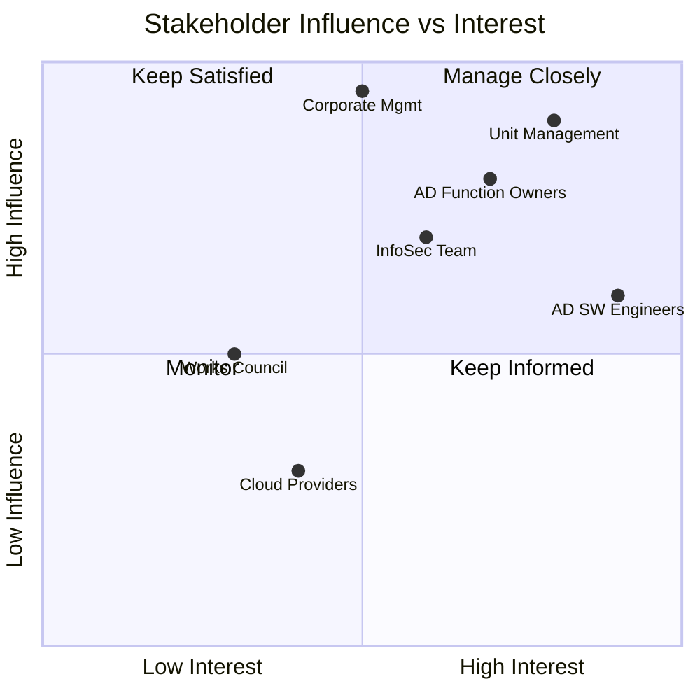

# REF-02: Stakeholder Register

## DDD Unit — Data Driven Development | AD/ADAS Tooling

**Document Owner:** Product Owner / QMR
**Last Review:** YYYY-MM-DD
**Next Review:** YYYY-MM-DD

---

## 1. Purpose

Identifies all relevant interested parties, their needs and expectations, and how we address them, as required by ISO 9001:2015 Clause 4.2.

---

## 2. Stakeholder Register

| # | Stakeholder | Category | Needs & Expectations | How We Address Them | Monitoring Method | Priority |
|---|-------------|----------|---------------------|---------------------|-------------------|----------|
| 1 | **AD/ADAS SW Engineers** | Primary Customer | Reliable, fast, well-documented tools; low-friction onboarding; responsive support | SLAs, user documentation, support channels, regular feedback sessions | NPS surveys, support tickets, sprint reviews | High |
| 2 | **AD Function Owners** | Internal Customer | Tools that enable compliant validation (ISO 26262, ASPICE) | Tool qualification evidence, compliance documentation | Quarterly alignment meetings | High |
| 3 | **Unit Management** | Management | Efficient resource use, strategic alignment, quality delivery | OKRs, management reviews, KPI dashboards | Monthly reporting, management review | High |
| 4 | **Corporate Management** | Top Management | Contribution to AD program success, cost efficiency | Strategic roadmap alignment, budget reporting | Quarterly business review | High |
| 5 | **Information Security Team** | Internal Regulator | Compliance with InfoSec policies, secure data handling | Security assessments, vulnerability management | Audit results, security metrics | High |
| 6 | **Data Protection Officer** | Internal Regulator | GDPR compliance, lawful data processing | Data protection impact assessments, anonymization | DPO reviews, compliance checks | High |
| 7 | **Works Council** | Employee Rep | Fair working conditions, transparent processes | Compliance with agreements, open communication | Regular consultation | Medium |
| 8 | **Cloud Providers (AWS/Azure)** | Supplier | Predictable consumption, timely payment, feedback | Procurement processes, service reviews | SLA monitoring, cost tracking | Medium |
| 9 | **Third-Party Tool Vendors** | Supplier | Clear requirements, fair evaluation | Vendor evaluation process, contractual SLAs | Performance reviews | Medium |
| 10 | **Regulatory Bodies** | External | Compliance with applicable regulations | Regulatory monitoring, compliance processes | Legal team coordination | Medium |
| 11 | **Open-Source Communities** | External | Responsible usage, contribution back | License compliance, upstream contributions | License scanning | Low |
| 12 | **New Team Members** | Internal | Clear onboarding, learning opportunities | Structured onboarding, mentoring, documentation | 30-60-90 day feedback | Medium |

---

## 3. Stakeholder Influence/Interest Matrix

---

## 4. Review Log

| Date | Reviewer | Changes Made |
|------|----------|-------------|
| YYYY-MM-DD | [Name] | Initial creation |
| | | |

---

*ISO 9001:2015 Reference: Clause 4.2*
